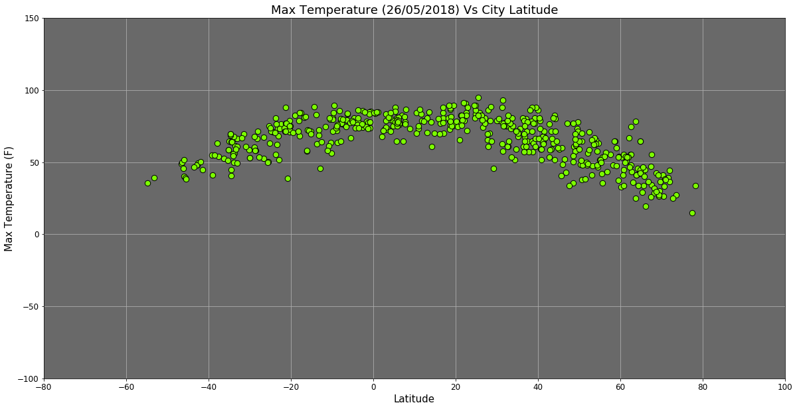
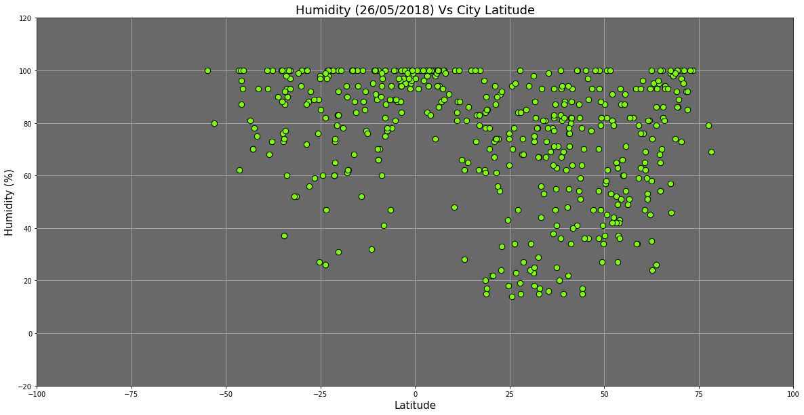
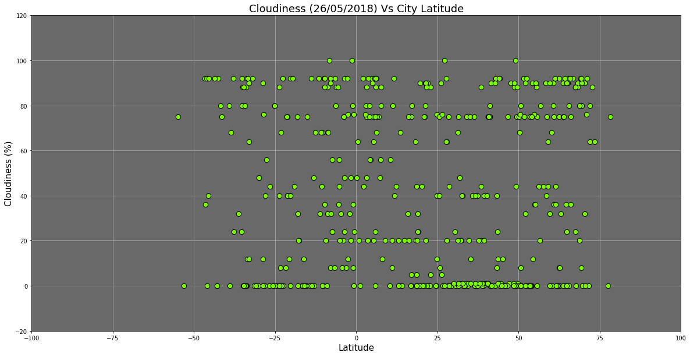
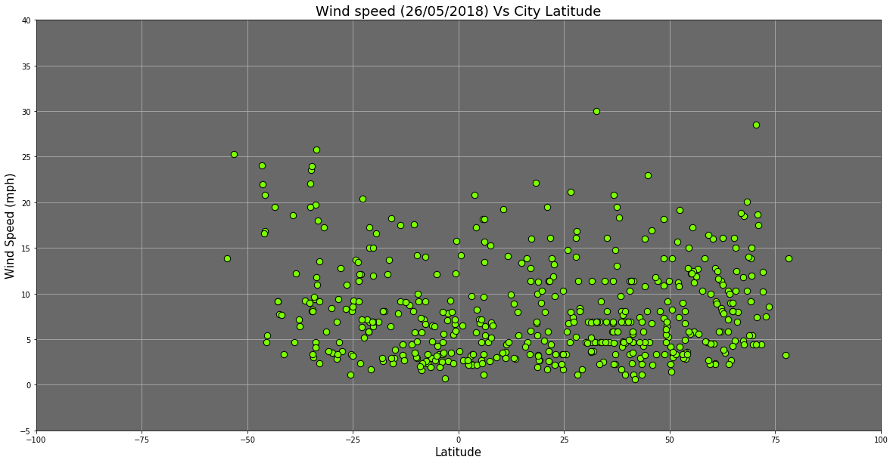
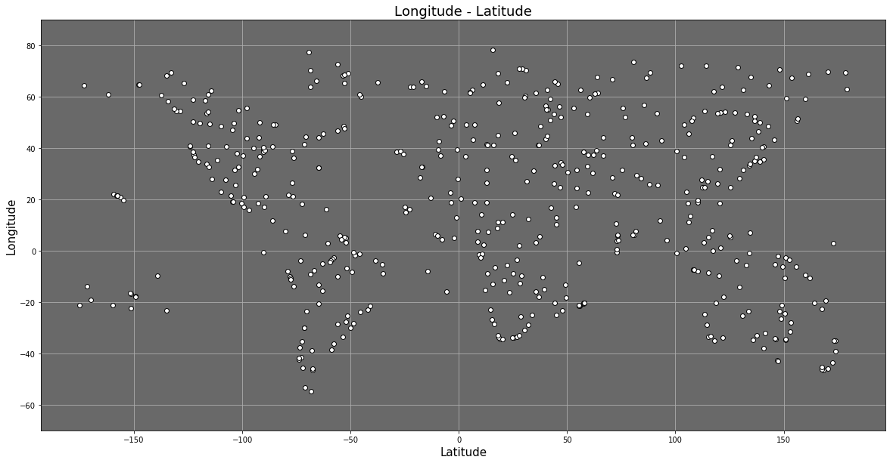

# WeatherPy

### Analysis

-  As expected , temperatures are higher closer to equator
-  No significant relation exists between latitude and humidity/windspeed/cloudiness
-  Majortity of cities have windspeeds lower than 15mph and humidity greater than 50%. More data is needed to arrive at a more definite relationship, if any


```python
# Dependencies
import random
import json
import requests
import pandas as pd
import matplotlib.pyplot as plt
import openweathermapy as ow
from citipy import citipy
from datetime import datetime
import urllib.response

# import api_key from config file
from config import api_key
```

Plothole#1: Since the assignment specifically instructed to use citipy, the approach is more convoluted than it should be. A more straight forward approach would have been taking the openweather map database of cities list and (if required, split them to multiple samples and) randomly picking 500 cities from the list and plotting them

Plothole#2: Citipy generates quite a few number of cities that are not present in openweathermap database. so instead, using only those cities, randomly generated by citipy, but only if present in owm improves the api usage efficiency and reduces the 
number of wasted api calls


```python
now = datetime.now().strftime("%d/%m/%Y")
#load the list of cities from owm database
with open('city.list.json', 'r', encoding="utf-8") as f:
    array = json.load(f)
```


```python
owmcity = []
for response in array:
    owmcity.append(response["name"].lower()+","+response["country"])
```

### Generate Cities list

Randomly generate 510 cities from citipy. Run the loop till all the duplicates are dropped
and only unique values remain (which are also present in the owm database)

P.S: 510(instead of 500) cities were chosen to account for those few cities that are present in the owm database list but
the api call fails with "not found" error.


```python
unique_cities = pd.DataFrame()
settings = {"units": "imperial", "appid": api_key}
columnnames = ["City","Country","Input Lat","Input Long"]

while (len(unique_cities.index)<510):
    city_row = []
    for i in range(510-len(unique_cities.index)):
        input_latitude = random.uniform(-90, 90)
        input_longitude = random.uniform(-180, 180)
        city = citipy.nearest_city(input_latitude,input_longitude)
        fullcity = city.city_name.lower()+","+city.country_code.upper()
        
        #use the city returned only if it's present in owmap database
        if fullcity in owmcity: 
            city_row.append([city.city_name.capitalize(),city.country_code.upper(),input_latitude,input_longitude])
            
    cities_df = pd.DataFrame(city_row,columns = columnnames)
    unique_cities = unique_cities.append(cities_df,ignore_index=True)
    unique_cities = unique_cities.drop_duplicates(subset=['City', 'Country'])
    unique_cities = unique_cities.reset_index(drop=True)
```


```python
url = "http://api.openweathermap.org/data/2.5/weather?"
units = "imperial"
weather_data = []
data = []
cities = unique_cities["City"]+","+unique_cities["Country"]
```

### Perform API Calls


```python
#Make the API Calls using the owmpy wrapper
print("Beginning Data Retrieval")
print("-"*27)
counter = 1
for city in cities:
    print(f"Processing Record {counter} of {len(unique_cities.index)} | {city}")
    print(f"{url}appid={api_key}&q={city}&units={settings['units']}")
    try:
        weather_data.append(ow.get_current(city, **settings))
    except urllib.error.HTTPError as y:
        if (y.code == 404):
            print(city+" is not found in OpenWeatherMap Database")
        else:
            print("Something is wrong with "+city+"." + y)
    except Exception as x:
        print("Error encountered when processing "+city)
        print(x)
    counter+=1
print(str(counter-1)+" Cities Queried")
print(str(len(weather_data))+" Cities Found and Retreived")
```

    Beginning Data Retrieval
    ---------------------------
    Processing Record 1 of 510 | Moerai,PF
    http://api.openweathermap.org/data/2.5/weather?appid=747defe6059e69d3bdfce6c2c60e918e&q=Moerai,PF&units=imperial
    Processing Record 2 of 510 | Butaritari,KI
    http://api.openweathermap.org/data/2.5/weather?appid=747defe6059e69d3bdfce6c2c60e918e&q=Butaritari,KI&units=imperial
    Processing Record 3 of 510 | Svetlogorsk,RU
    http://api.openweathermap.org/data/2.5/weather?appid=747defe6059e69d3bdfce6c2c60e918e&q=Svetlogorsk,RU&units=imperial
    Processing Record 4 of 510 | Harper,LR
    http://api.openweathermap.org/data/2.5/weather?appid=747defe6059e69d3bdfce6c2c60e918e&q=Harper,LR&units=imperial
    Processing Record 5 of 510 | Maniitsoq,GL
    http://api.openweathermap.org/data/2.5/weather?appid=747defe6059e69d3bdfce6c2c60e918e&q=Maniitsoq,GL&units=imperial
    Processing Record 6 of 510 | Coquimbo,CL
    http://api.openweathermap.org/data/2.5/weather?appid=747defe6059e69d3bdfce6c2c60e918e&q=Coquimbo,CL&units=imperial
    Processing Record 7 of 510 | Koumra,TD
    http://api.openweathermap.org/data/2.5/weather?appid=747defe6059e69d3bdfce6c2c60e918e&q=Koumra,TD&units=imperial
    Processing Record 8 of 510 | Castro,CL
    http://api.openweathermap.org/data/2.5/weather?appid=747defe6059e69d3bdfce6c2c60e918e&q=Castro,CL&units=imperial
    Processing Record 9 of 510 | Ponta do sol,CV
    http://api.openweathermap.org/data/2.5/weather?appid=747defe6059e69d3bdfce6c2c60e918e&q=Ponta do sol,CV&units=imperial
    Processing Record 10 of 510 | Nanortalik,GL
    http://api.openweathermap.org/data/2.5/weather?appid=747defe6059e69d3bdfce6c2c60e918e&q=Nanortalik,GL&units=imperial
    Processing Record 11 of 510 | Victoria,SC
    http://api.openweathermap.org/data/2.5/weather?appid=747defe6059e69d3bdfce6c2c60e918e&q=Victoria,SC&units=imperial
    Processing Record 12 of 510 | Saint-philippe,RE
    http://api.openweathermap.org/data/2.5/weather?appid=747defe6059e69d3bdfce6c2c60e918e&q=Saint-philippe,RE&units=imperial
    Processing Record 13 of 510 | Iqaluit,CA
    http://api.openweathermap.org/data/2.5/weather?appid=747defe6059e69d3bdfce6c2c60e918e&q=Iqaluit,CA&units=imperial
    Processing Record 14 of 510 | Atuona,PF
    http://api.openweathermap.org/data/2.5/weather?appid=747defe6059e69d3bdfce6c2c60e918e&q=Atuona,PF&units=imperial
    Processing Record 15 of 510 | Adrar,DZ
    http://api.openweathermap.org/data/2.5/weather?appid=747defe6059e69d3bdfce6c2c60e918e&q=Adrar,DZ&units=imperial
    Processing Record 16 of 510 | Gold coast,AU
    http://api.openweathermap.org/data/2.5/weather?appid=747defe6059e69d3bdfce6c2c60e918e&q=Gold coast,AU&units=imperial
    Processing Record 17 of 510 | Busselton,AU
    http://api.openweathermap.org/data/2.5/weather?appid=747defe6059e69d3bdfce6c2c60e918e&q=Busselton,AU&units=imperial
    Processing Record 18 of 510 | Ambilobe,MG
    http://api.openweathermap.org/data/2.5/weather?appid=747defe6059e69d3bdfce6c2c60e918e&q=Ambilobe,MG&units=imperial
    Processing Record 19 of 510 | Georgetown,SH
    http://api.openweathermap.org/data/2.5/weather?appid=747defe6059e69d3bdfce6c2c60e918e&q=Georgetown,SH&units=imperial
    Processing Record 20 of 510 | Biloela,AU
    http://api.openweathermap.org/data/2.5/weather?appid=747defe6059e69d3bdfce6c2c60e918e&q=Biloela,AU&units=imperial
    Processing Record 21 of 510 | Tasiilaq,GL
    http://api.openweathermap.org/data/2.5/weather?appid=747defe6059e69d3bdfce6c2c60e918e&q=Tasiilaq,GL&units=imperial
    Processing Record 22 of 510 | Puerto padre,CU
    http://api.openweathermap.org/data/2.5/weather?appid=747defe6059e69d3bdfce6c2c60e918e&q=Puerto padre,CU&units=imperial
    Processing Record 23 of 510 | Albany,AU
    http://api.openweathermap.org/data/2.5/weather?appid=747defe6059e69d3bdfce6c2c60e918e&q=Albany,AU&units=imperial
    Processing Record 24 of 510 | Chuy,UY
    http://api.openweathermap.org/data/2.5/weather?appid=747defe6059e69d3bdfce6c2c60e918e&q=Chuy,UY&units=imperial
    Processing Record 25 of 510 | Jamestown,SH
    http://api.openweathermap.org/data/2.5/weather?appid=747defe6059e69d3bdfce6c2c60e918e&q=Jamestown,SH&units=imperial
    Processing Record 26 of 510 | Port elizabeth,ZA
    http://api.openweathermap.org/data/2.5/weather?appid=747defe6059e69d3bdfce6c2c60e918e&q=Port elizabeth,ZA&units=imperial
    Processing Record 27 of 510 | Vaini,TO
    http://api.openweathermap.org/data/2.5/weather?appid=747defe6059e69d3bdfce6c2c60e918e&q=Vaini,TO&units=imperial
    Processing Record 28 of 510 | Namioka,JP
    http://api.openweathermap.org/data/2.5/weather?appid=747defe6059e69d3bdfce6c2c60e918e&q=Namioka,JP&units=imperial
    Processing Record 29 of 510 | Port hedland,AU
    http://api.openweathermap.org/data/2.5/weather?appid=747defe6059e69d3bdfce6c2c60e918e&q=Port hedland,AU&units=imperial
    Processing Record 30 of 510 | Imeni poliny osipenko,RU
    http://api.openweathermap.org/data/2.5/weather?appid=747defe6059e69d3bdfce6c2c60e918e&q=Imeni poliny osipenko,RU&units=imperial
    Processing Record 31 of 510 | Hermanus,ZA
    http://api.openweathermap.org/data/2.5/weather?appid=747defe6059e69d3bdfce6c2c60e918e&q=Hermanus,ZA&units=imperial
    Processing Record 32 of 510 | Bluff,NZ
    http://api.openweathermap.org/data/2.5/weather?appid=747defe6059e69d3bdfce6c2c60e918e&q=Bluff,NZ&units=imperial
    Processing Record 33 of 510 | Urucara,BR
    http://api.openweathermap.org/data/2.5/weather?appid=747defe6059e69d3bdfce6c2c60e918e&q=Urucara,BR&units=imperial
    Processing Record 34 of 510 | Punta arenas,CL
    http://api.openweathermap.org/data/2.5/weather?appid=747defe6059e69d3bdfce6c2c60e918e&q=Punta arenas,CL&units=imperial
    Processing Record 35 of 510 | Tiksi,RU
    http://api.openweathermap.org/data/2.5/weather?appid=747defe6059e69d3bdfce6c2c60e918e&q=Tiksi,RU&units=imperial
    Processing Record 36 of 510 | Ushuaia,AR
    http://api.openweathermap.org/data/2.5/weather?appid=747defe6059e69d3bdfce6c2c60e918e&q=Ushuaia,AR&units=imperial
    Processing Record 37 of 510 | Souillac,MU
    http://api.openweathermap.org/data/2.5/weather?appid=747defe6059e69d3bdfce6c2c60e918e&q=Souillac,MU&units=imperial
    Processing Record 38 of 510 | Port alfred,ZA
    http://api.openweathermap.org/data/2.5/weather?appid=747defe6059e69d3bdfce6c2c60e918e&q=Port alfred,ZA&units=imperial
    Processing Record 39 of 510 | Ilulissat,GL
    http://api.openweathermap.org/data/2.5/weather?appid=747defe6059e69d3bdfce6c2c60e918e&q=Ilulissat,GL&units=imperial
    Processing Record 40 of 510 | Rikitea,PF
    http://api.openweathermap.org/data/2.5/weather?appid=747defe6059e69d3bdfce6c2c60e918e&q=Rikitea,PF&units=imperial
    Processing Record 41 of 510 | Pemberton,CA
    http://api.openweathermap.org/data/2.5/weather?appid=747defe6059e69d3bdfce6c2c60e918e&q=Pemberton,CA&units=imperial
    Processing Record 42 of 510 | Richards bay,ZA
    http://api.openweathermap.org/data/2.5/weather?appid=747defe6059e69d3bdfce6c2c60e918e&q=Richards bay,ZA&units=imperial
    Processing Record 43 of 510 | Bengkulu,ID
    http://api.openweathermap.org/data/2.5/weather?appid=747defe6059e69d3bdfce6c2c60e918e&q=Bengkulu,ID&units=imperial
    Bengkulu,ID is not found in OpenWeatherMap Database
    Processing Record 44 of 510 | Baiyin,CN
    http://api.openweathermap.org/data/2.5/weather?appid=747defe6059e69d3bdfce6c2c60e918e&q=Baiyin,CN&units=imperial
    Processing Record 45 of 510 | Kahului,US
    http://api.openweathermap.org/data/2.5/weather?appid=747defe6059e69d3bdfce6c2c60e918e&q=Kahului,US&units=imperial
    Processing Record 46 of 510 | Mahebourg,MU
    http://api.openweathermap.org/data/2.5/weather?appid=747defe6059e69d3bdfce6c2c60e918e&q=Mahebourg,MU&units=imperial
    Processing Record 47 of 510 | Cidreira,BR
    http://api.openweathermap.org/data/2.5/weather?appid=747defe6059e69d3bdfce6c2c60e918e&q=Cidreira,BR&units=imperial
    Processing Record 48 of 510 | Hasaki,JP
    http://api.openweathermap.org/data/2.5/weather?appid=747defe6059e69d3bdfce6c2c60e918e&q=Hasaki,JP&units=imperial
    Processing Record 49 of 510 | Lebu,CL
    http://api.openweathermap.org/data/2.5/weather?appid=747defe6059e69d3bdfce6c2c60e918e&q=Lebu,CL&units=imperial
    Processing Record 50 of 510 | Pevek,RU
    http://api.openweathermap.org/data/2.5/weather?appid=747defe6059e69d3bdfce6c2c60e918e&q=Pevek,RU&units=imperial
    Processing Record 51 of 510 | Cape town,ZA
    http://api.openweathermap.org/data/2.5/weather?appid=747defe6059e69d3bdfce6c2c60e918e&q=Cape town,ZA&units=imperial
    Processing Record 52 of 510 | Hami,CN
    http://api.openweathermap.org/data/2.5/weather?appid=747defe6059e69d3bdfce6c2c60e918e&q=Hami,CN&units=imperial
    Processing Record 53 of 510 | Saldanha,ZA
    http://api.openweathermap.org/data/2.5/weather?appid=747defe6059e69d3bdfce6c2c60e918e&q=Saldanha,ZA&units=imperial
    Processing Record 54 of 510 | Carsamba,TR
    http://api.openweathermap.org/data/2.5/weather?appid=747defe6059e69d3bdfce6c2c60e918e&q=Carsamba,TR&units=imperial
    Processing Record 55 of 510 | Adamas,GR
    http://api.openweathermap.org/data/2.5/weather?appid=747defe6059e69d3bdfce6c2c60e918e&q=Adamas,GR&units=imperial
    Processing Record 56 of 510 | Jumla,NP
    http://api.openweathermap.org/data/2.5/weather?appid=747defe6059e69d3bdfce6c2c60e918e&q=Jumla,NP&units=imperial
    Processing Record 57 of 510 | New norfolk,AU
    http://api.openweathermap.org/data/2.5/weather?appid=747defe6059e69d3bdfce6c2c60e918e&q=New norfolk,AU&units=imperial
    Processing Record 58 of 510 | Kamina,CD
    http://api.openweathermap.org/data/2.5/weather?appid=747defe6059e69d3bdfce6c2c60e918e&q=Kamina,CD&units=imperial
    Processing Record 59 of 510 | Puerto montt,CL
    http://api.openweathermap.org/data/2.5/weather?appid=747defe6059e69d3bdfce6c2c60e918e&q=Puerto montt,CL&units=imperial
    Processing Record 60 of 510 | Dolores,AR
    http://api.openweathermap.org/data/2.5/weather?appid=747defe6059e69d3bdfce6c2c60e918e&q=Dolores,AR&units=imperial
    Processing Record 61 of 510 | Dikson,RU
    http://api.openweathermap.org/data/2.5/weather?appid=747defe6059e69d3bdfce6c2c60e918e&q=Dikson,RU&units=imperial
    Processing Record 62 of 510 | Hobart,AU
    http://api.openweathermap.org/data/2.5/weather?appid=747defe6059e69d3bdfce6c2c60e918e&q=Hobart,AU&units=imperial
    Processing Record 63 of 510 | Srednekolymsk,RU
    http://api.openweathermap.org/data/2.5/weather?appid=747defe6059e69d3bdfce6c2c60e918e&q=Srednekolymsk,RU&units=imperial
    Processing Record 64 of 510 | Manadhoo,MV
    http://api.openweathermap.org/data/2.5/weather?appid=747defe6059e69d3bdfce6c2c60e918e&q=Manadhoo,MV&units=imperial
    Processing Record 65 of 510 | Saint-francois,GP
    http://api.openweathermap.org/data/2.5/weather?appid=747defe6059e69d3bdfce6c2c60e918e&q=Saint-francois,GP&units=imperial
    Processing Record 66 of 510 | Honiara,SB
    http://api.openweathermap.org/data/2.5/weather?appid=747defe6059e69d3bdfce6c2c60e918e&q=Honiara,SB&units=imperial
    Processing Record 67 of 510 | Avarua,CK
    http://api.openweathermap.org/data/2.5/weather?appid=747defe6059e69d3bdfce6c2c60e918e&q=Avarua,CK&units=imperial
    Processing Record 68 of 510 | Salalah,OM
    http://api.openweathermap.org/data/2.5/weather?appid=747defe6059e69d3bdfce6c2c60e918e&q=Salalah,OM&units=imperial
    Processing Record 69 of 510 | Longyearbyen,SJ
    http://api.openweathermap.org/data/2.5/weather?appid=747defe6059e69d3bdfce6c2c60e918e&q=Longyearbyen,SJ&units=imperial
    Processing Record 70 of 510 | Emerald,AU
    http://api.openweathermap.org/data/2.5/weather?appid=747defe6059e69d3bdfce6c2c60e918e&q=Emerald,AU&units=imperial
    Processing Record 71 of 510 | Qaanaaq,GL
    http://api.openweathermap.org/data/2.5/weather?appid=747defe6059e69d3bdfce6c2c60e918e&q=Qaanaaq,GL&units=imperial
    Processing Record 72 of 510 | Thompson,CA
    http://api.openweathermap.org/data/2.5/weather?appid=747defe6059e69d3bdfce6c2c60e918e&q=Thompson,CA&units=imperial
    Processing Record 73 of 510 | Alofi,NU
    http://api.openweathermap.org/data/2.5/weather?appid=747defe6059e69d3bdfce6c2c60e918e&q=Alofi,NU&units=imperial
    Processing Record 74 of 510 | Suntar,RU
    http://api.openweathermap.org/data/2.5/weather?appid=747defe6059e69d3bdfce6c2c60e918e&q=Suntar,RU&units=imperial
    Processing Record 75 of 510 | Slavonski brod,HR
    http://api.openweathermap.org/data/2.5/weather?appid=747defe6059e69d3bdfce6c2c60e918e&q=Slavonski brod,HR&units=imperial
    Processing Record 76 of 510 | East london,ZA
    http://api.openweathermap.org/data/2.5/weather?appid=747defe6059e69d3bdfce6c2c60e918e&q=East london,ZA&units=imperial
    Processing Record 77 of 510 | Bonavista,CA
    http://api.openweathermap.org/data/2.5/weather?appid=747defe6059e69d3bdfce6c2c60e918e&q=Bonavista,CA&units=imperial
    Processing Record 78 of 510 | Sabang,ID
    http://api.openweathermap.org/data/2.5/weather?appid=747defe6059e69d3bdfce6c2c60e918e&q=Sabang,ID&units=imperial
    Processing Record 79 of 510 | Mar del plata,AR
    http://api.openweathermap.org/data/2.5/weather?appid=747defe6059e69d3bdfce6c2c60e918e&q=Mar del plata,AR&units=imperial
    Processing Record 80 of 510 | Ouango,CF
    http://api.openweathermap.org/data/2.5/weather?appid=747defe6059e69d3bdfce6c2c60e918e&q=Ouango,CF&units=imperial
    Ouango,CF is not found in OpenWeatherMap Database
    Processing Record 81 of 510 | Torbay,CA
    http://api.openweathermap.org/data/2.5/weather?appid=747defe6059e69d3bdfce6c2c60e918e&q=Torbay,CA&units=imperial
    Processing Record 82 of 510 | Baghdogra,IN
    http://api.openweathermap.org/data/2.5/weather?appid=747defe6059e69d3bdfce6c2c60e918e&q=Baghdogra,IN&units=imperial
    Processing Record 83 of 510 | Yangshe,CN
    http://api.openweathermap.org/data/2.5/weather?appid=747defe6059e69d3bdfce6c2c60e918e&q=Yangshe,CN&units=imperial
    Processing Record 84 of 510 | Provideniya,RU
    http://api.openweathermap.org/data/2.5/weather?appid=747defe6059e69d3bdfce6c2c60e918e&q=Provideniya,RU&units=imperial
    Processing Record 85 of 510 | Glendive,US
    http://api.openweathermap.org/data/2.5/weather?appid=747defe6059e69d3bdfce6c2c60e918e&q=Glendive,US&units=imperial
    Processing Record 86 of 510 | Neuquen,AR
    http://api.openweathermap.org/data/2.5/weather?appid=747defe6059e69d3bdfce6c2c60e918e&q=Neuquen,AR&units=imperial
    Processing Record 87 of 510 | Namibe,AO
    http://api.openweathermap.org/data/2.5/weather?appid=747defe6059e69d3bdfce6c2c60e918e&q=Namibe,AO&units=imperial
    Processing Record 88 of 510 | Vinh,VN
    http://api.openweathermap.org/data/2.5/weather?appid=747defe6059e69d3bdfce6c2c60e918e&q=Vinh,VN&units=imperial
    Processing Record 89 of 510 | Sao filipe,CV
    http://api.openweathermap.org/data/2.5/weather?appid=747defe6059e69d3bdfce6c2c60e918e&q=Sao filipe,CV&units=imperial
    Processing Record 90 of 510 | Norman wells,CA
    http://api.openweathermap.org/data/2.5/weather?appid=747defe6059e69d3bdfce6c2c60e918e&q=Norman wells,CA&units=imperial
    Processing Record 91 of 510 | Kirakira,SB
    http://api.openweathermap.org/data/2.5/weather?appid=747defe6059e69d3bdfce6c2c60e918e&q=Kirakira,SB&units=imperial
    Processing Record 92 of 510 | Juneau,US
    http://api.openweathermap.org/data/2.5/weather?appid=747defe6059e69d3bdfce6c2c60e918e&q=Juneau,US&units=imperial
    Processing Record 93 of 510 | Bilma,NE
    http://api.openweathermap.org/data/2.5/weather?appid=747defe6059e69d3bdfce6c2c60e918e&q=Bilma,NE&units=imperial
    Processing Record 94 of 510 | Arraial do cabo,BR
    http://api.openweathermap.org/data/2.5/weather?appid=747defe6059e69d3bdfce6c2c60e918e&q=Arraial do cabo,BR&units=imperial
    Processing Record 95 of 510 | Wanning,CN
    http://api.openweathermap.org/data/2.5/weather?appid=747defe6059e69d3bdfce6c2c60e918e&q=Wanning,CN&units=imperial
    Processing Record 96 of 510 | Komsomolskiy,RU
    http://api.openweathermap.org/data/2.5/weather?appid=747defe6059e69d3bdfce6c2c60e918e&q=Komsomolskiy,RU&units=imperial
    Processing Record 97 of 510 | Nemuro,JP
    http://api.openweathermap.org/data/2.5/weather?appid=747defe6059e69d3bdfce6c2c60e918e&q=Nemuro,JP&units=imperial
    Processing Record 98 of 510 | Tevaitoa,PF
    http://api.openweathermap.org/data/2.5/weather?appid=747defe6059e69d3bdfce6c2c60e918e&q=Tevaitoa,PF&units=imperial
    Processing Record 99 of 510 | Iquitos,PE
    http://api.openweathermap.org/data/2.5/weather?appid=747defe6059e69d3bdfce6c2c60e918e&q=Iquitos,PE&units=imperial
    Processing Record 100 of 510 | San ramon,BO
    http://api.openweathermap.org/data/2.5/weather?appid=747defe6059e69d3bdfce6c2c60e918e&q=San ramon,BO&units=imperial
    Processing Record 101 of 510 | Ancud,CL
    http://api.openweathermap.org/data/2.5/weather?appid=747defe6059e69d3bdfce6c2c60e918e&q=Ancud,CL&units=imperial
    Processing Record 102 of 510 | Kermanshah,IR
    http://api.openweathermap.org/data/2.5/weather?appid=747defe6059e69d3bdfce6c2c60e918e&q=Kermanshah,IR&units=imperial
    Processing Record 103 of 510 | Alta floresta,BR
    http://api.openweathermap.org/data/2.5/weather?appid=747defe6059e69d3bdfce6c2c60e918e&q=Alta floresta,BR&units=imperial
    Processing Record 104 of 510 | Jiazi,CN
    http://api.openweathermap.org/data/2.5/weather?appid=747defe6059e69d3bdfce6c2c60e918e&q=Jiazi,CN&units=imperial
    Processing Record 105 of 510 | Bredasdorp,ZA
    http://api.openweathermap.org/data/2.5/weather?appid=747defe6059e69d3bdfce6c2c60e918e&q=Bredasdorp,ZA&units=imperial
    Processing Record 106 of 510 | Puerto ayora,EC
    http://api.openweathermap.org/data/2.5/weather?appid=747defe6059e69d3bdfce6c2c60e918e&q=Puerto ayora,EC&units=imperial
    Processing Record 107 of 510 | Severo-kurilsk,RU
    http://api.openweathermap.org/data/2.5/weather?appid=747defe6059e69d3bdfce6c2c60e918e&q=Severo-kurilsk,RU&units=imperial
    Processing Record 108 of 510 | Dunedin,NZ
    http://api.openweathermap.org/data/2.5/weather?appid=747defe6059e69d3bdfce6c2c60e918e&q=Dunedin,NZ&units=imperial
    Processing Record 109 of 510 | Weymouth,GB
    http://api.openweathermap.org/data/2.5/weather?appid=747defe6059e69d3bdfce6c2c60e918e&q=Weymouth,GB&units=imperial
    Processing Record 110 of 510 | Sainte-maxime,FR
    http://api.openweathermap.org/data/2.5/weather?appid=747defe6059e69d3bdfce6c2c60e918e&q=Sainte-maxime,FR&units=imperial
    Processing Record 111 of 510 | Kasongo-lunda,CD
    http://api.openweathermap.org/data/2.5/weather?appid=747defe6059e69d3bdfce6c2c60e918e&q=Kasongo-lunda,CD&units=imperial
    Processing Record 112 of 510 | Aklavik,CA
    http://api.openweathermap.org/data/2.5/weather?appid=747defe6059e69d3bdfce6c2c60e918e&q=Aklavik,CA&units=imperial
    Processing Record 113 of 510 | Pangnirtung,CA
    http://api.openweathermap.org/data/2.5/weather?appid=747defe6059e69d3bdfce6c2c60e918e&q=Pangnirtung,CA&units=imperial
    Processing Record 114 of 510 | Jian,CN
    http://api.openweathermap.org/data/2.5/weather?appid=747defe6059e69d3bdfce6c2c60e918e&q=Jian,CN&units=imperial
    Processing Record 115 of 510 | Saint george,BM
    http://api.openweathermap.org/data/2.5/weather?appid=747defe6059e69d3bdfce6c2c60e918e&q=Saint george,BM&units=imperial
    Processing Record 116 of 510 | Yellowknife,CA
    http://api.openweathermap.org/data/2.5/weather?appid=747defe6059e69d3bdfce6c2c60e918e&q=Yellowknife,CA&units=imperial
    Processing Record 117 of 510 | Lianzhou,CN
    http://api.openweathermap.org/data/2.5/weather?appid=747defe6059e69d3bdfce6c2c60e918e&q=Lianzhou,CN&units=imperial
    Processing Record 118 of 510 | Newport,US
    http://api.openweathermap.org/data/2.5/weather?appid=747defe6059e69d3bdfce6c2c60e918e&q=Newport,US&units=imperial
    Processing Record 119 of 510 | Am timan,TD
    http://api.openweathermap.org/data/2.5/weather?appid=747defe6059e69d3bdfce6c2c60e918e&q=Am timan,TD&units=imperial
    Processing Record 120 of 510 | Rudnichnyy,RU
    http://api.openweathermap.org/data/2.5/weather?appid=747defe6059e69d3bdfce6c2c60e918e&q=Rudnichnyy,RU&units=imperial
    Processing Record 121 of 510 | Visby,SE
    http://api.openweathermap.org/data/2.5/weather?appid=747defe6059e69d3bdfce6c2c60e918e&q=Visby,SE&units=imperial
    Processing Record 122 of 510 | Kapaa,US
    http://api.openweathermap.org/data/2.5/weather?appid=747defe6059e69d3bdfce6c2c60e918e&q=Kapaa,US&units=imperial
    Processing Record 123 of 510 | Aksu,KZ
    http://api.openweathermap.org/data/2.5/weather?appid=747defe6059e69d3bdfce6c2c60e918e&q=Aksu,KZ&units=imperial
    Processing Record 124 of 510 | Kavaratti,IN
    http://api.openweathermap.org/data/2.5/weather?appid=747defe6059e69d3bdfce6c2c60e918e&q=Kavaratti,IN&units=imperial
    Processing Record 125 of 510 | Morondava,MG
    http://api.openweathermap.org/data/2.5/weather?appid=747defe6059e69d3bdfce6c2c60e918e&q=Morondava,MG&units=imperial
    Processing Record 126 of 510 | Naze,JP
    http://api.openweathermap.org/data/2.5/weather?appid=747defe6059e69d3bdfce6c2c60e918e&q=Naze,JP&units=imperial
    Processing Record 127 of 510 | Bethel,US
    http://api.openweathermap.org/data/2.5/weather?appid=747defe6059e69d3bdfce6c2c60e918e&q=Bethel,US&units=imperial
    Processing Record 128 of 510 | Garbolovo,RU
    http://api.openweathermap.org/data/2.5/weather?appid=747defe6059e69d3bdfce6c2c60e918e&q=Garbolovo,RU&units=imperial
    Processing Record 129 of 510 | Roald,NO
    http://api.openweathermap.org/data/2.5/weather?appid=747defe6059e69d3bdfce6c2c60e918e&q=Roald,NO&units=imperial
    Processing Record 130 of 510 | Huarmey,PE
    http://api.openweathermap.org/data/2.5/weather?appid=747defe6059e69d3bdfce6c2c60e918e&q=Huarmey,PE&units=imperial
    Processing Record 131 of 510 | Clyde river,CA
    http://api.openweathermap.org/data/2.5/weather?appid=747defe6059e69d3bdfce6c2c60e918e&q=Clyde river,CA&units=imperial
    Processing Record 132 of 510 | Grindavik,IS
    http://api.openweathermap.org/data/2.5/weather?appid=747defe6059e69d3bdfce6c2c60e918e&q=Grindavik,IS&units=imperial
    Processing Record 133 of 510 | College,US
    http://api.openweathermap.org/data/2.5/weather?appid=747defe6059e69d3bdfce6c2c60e918e&q=College,US&units=imperial
    Processing Record 134 of 510 | Beringovskiy,RU
    http://api.openweathermap.org/data/2.5/weather?appid=747defe6059e69d3bdfce6c2c60e918e&q=Beringovskiy,RU&units=imperial
    Processing Record 135 of 510 | Fortuna,US
    http://api.openweathermap.org/data/2.5/weather?appid=747defe6059e69d3bdfce6c2c60e918e&q=Fortuna,US&units=imperial
    Processing Record 136 of 510 | Ofaqim,IL
    http://api.openweathermap.org/data/2.5/weather?appid=747defe6059e69d3bdfce6c2c60e918e&q=Ofaqim,IL&units=imperial
    Processing Record 137 of 510 | Kodiak,US
    http://api.openweathermap.org/data/2.5/weather?appid=747defe6059e69d3bdfce6c2c60e918e&q=Kodiak,US&units=imperial
    Processing Record 138 of 510 | La serena,CL
    http://api.openweathermap.org/data/2.5/weather?appid=747defe6059e69d3bdfce6c2c60e918e&q=La serena,CL&units=imperial
    Processing Record 139 of 510 | Kushima,JP
    http://api.openweathermap.org/data/2.5/weather?appid=747defe6059e69d3bdfce6c2c60e918e&q=Kushima,JP&units=imperial
    Processing Record 140 of 510 | Caala,AO
    http://api.openweathermap.org/data/2.5/weather?appid=747defe6059e69d3bdfce6c2c60e918e&q=Caala,AO&units=imperial
    Processing Record 141 of 510 | Hithadhoo,MV
    http://api.openweathermap.org/data/2.5/weather?appid=747defe6059e69d3bdfce6c2c60e918e&q=Hithadhoo,MV&units=imperial
    Processing Record 142 of 510 | San patricio,MX
    http://api.openweathermap.org/data/2.5/weather?appid=747defe6059e69d3bdfce6c2c60e918e&q=San patricio,MX&units=imperial
    Processing Record 143 of 510 | Fernie,CA
    http://api.openweathermap.org/data/2.5/weather?appid=747defe6059e69d3bdfce6c2c60e918e&q=Fernie,CA&units=imperial
    Processing Record 144 of 510 | Kavieng,PG
    http://api.openweathermap.org/data/2.5/weather?appid=747defe6059e69d3bdfce6c2c60e918e&q=Kavieng,PG&units=imperial
    Processing Record 145 of 510 | Terrace,CA
    http://api.openweathermap.org/data/2.5/weather?appid=747defe6059e69d3bdfce6c2c60e918e&q=Terrace,CA&units=imperial
    Processing Record 146 of 510 | Hamilton,BM
    http://api.openweathermap.org/data/2.5/weather?appid=747defe6059e69d3bdfce6c2c60e918e&q=Hamilton,BM&units=imperial
    Processing Record 147 of 510 | Frontera,MX
    http://api.openweathermap.org/data/2.5/weather?appid=747defe6059e69d3bdfce6c2c60e918e&q=Frontera,MX&units=imperial
    Processing Record 148 of 510 | Dhandhuka,IN
    http://api.openweathermap.org/data/2.5/weather?appid=747defe6059e69d3bdfce6c2c60e918e&q=Dhandhuka,IN&units=imperial
    Processing Record 149 of 510 | Riyadh,SA
    http://api.openweathermap.org/data/2.5/weather?appid=747defe6059e69d3bdfce6c2c60e918e&q=Riyadh,SA&units=imperial
    Processing Record 150 of 510 | Omboue,GA
    http://api.openweathermap.org/data/2.5/weather?appid=747defe6059e69d3bdfce6c2c60e918e&q=Omboue,GA&units=imperial
    Processing Record 151 of 510 | Berbera,SO
    http://api.openweathermap.org/data/2.5/weather?appid=747defe6059e69d3bdfce6c2c60e918e&q=Berbera,SO&units=imperial
    Processing Record 152 of 510 | Davila,PH
    http://api.openweathermap.org/data/2.5/weather?appid=747defe6059e69d3bdfce6c2c60e918e&q=Davila,PH&units=imperial
    Processing Record 153 of 510 | Sur,OM
    http://api.openweathermap.org/data/2.5/weather?appid=747defe6059e69d3bdfce6c2c60e918e&q=Sur,OM&units=imperial
    Processing Record 154 of 510 | Barrow,US
    http://api.openweathermap.org/data/2.5/weather?appid=747defe6059e69d3bdfce6c2c60e918e&q=Barrow,US&units=imperial
    Processing Record 155 of 510 | Lufilufi,WS
    http://api.openweathermap.org/data/2.5/weather?appid=747defe6059e69d3bdfce6c2c60e918e&q=Lufilufi,WS&units=imperial
    Processing Record 156 of 510 | Hilo,US
    http://api.openweathermap.org/data/2.5/weather?appid=747defe6059e69d3bdfce6c2c60e918e&q=Hilo,US&units=imperial
    Processing Record 157 of 510 | Port blair,IN
    http://api.openweathermap.org/data/2.5/weather?appid=747defe6059e69d3bdfce6c2c60e918e&q=Port blair,IN&units=imperial
    Processing Record 158 of 510 | Huanren,CN
    http://api.openweathermap.org/data/2.5/weather?appid=747defe6059e69d3bdfce6c2c60e918e&q=Huanren,CN&units=imperial
    Processing Record 159 of 510 | Husavik,IS
    http://api.openweathermap.org/data/2.5/weather?appid=747defe6059e69d3bdfce6c2c60e918e&q=Husavik,IS&units=imperial
    Processing Record 160 of 510 | Port macquarie,AU
    http://api.openweathermap.org/data/2.5/weather?appid=747defe6059e69d3bdfce6c2c60e918e&q=Port macquarie,AU&units=imperial
    Processing Record 161 of 510 | Batticaloa,LK
    http://api.openweathermap.org/data/2.5/weather?appid=747defe6059e69d3bdfce6c2c60e918e&q=Batticaloa,LK&units=imperial
    Processing Record 162 of 510 | Jacmel,HT
    http://api.openweathermap.org/data/2.5/weather?appid=747defe6059e69d3bdfce6c2c60e918e&q=Jacmel,HT&units=imperial
    Processing Record 163 of 510 | Weyburn,CA
    http://api.openweathermap.org/data/2.5/weather?appid=747defe6059e69d3bdfce6c2c60e918e&q=Weyburn,CA&units=imperial
    Processing Record 164 of 510 | Kapurthala,IN
    http://api.openweathermap.org/data/2.5/weather?appid=747defe6059e69d3bdfce6c2c60e918e&q=Kapurthala,IN&units=imperial
    Processing Record 165 of 510 | Poum,NC
    http://api.openweathermap.org/data/2.5/weather?appid=747defe6059e69d3bdfce6c2c60e918e&q=Poum,NC&units=imperial
    Processing Record 166 of 510 | Pokhara,NP
    http://api.openweathermap.org/data/2.5/weather?appid=747defe6059e69d3bdfce6c2c60e918e&q=Pokhara,NP&units=imperial
    Processing Record 167 of 510 | Tuktoyaktuk,CA
    http://api.openweathermap.org/data/2.5/weather?appid=747defe6059e69d3bdfce6c2c60e918e&q=Tuktoyaktuk,CA&units=imperial
    Processing Record 168 of 510 | Kloulklubed,PW
    http://api.openweathermap.org/data/2.5/weather?appid=747defe6059e69d3bdfce6c2c60e918e&q=Kloulklubed,PW&units=imperial
    Processing Record 169 of 510 | Axim,GH
    http://api.openweathermap.org/data/2.5/weather?appid=747defe6059e69d3bdfce6c2c60e918e&q=Axim,GH&units=imperial
    Processing Record 170 of 510 | Talnakh,RU
    http://api.openweathermap.org/data/2.5/weather?appid=747defe6059e69d3bdfce6c2c60e918e&q=Talnakh,RU&units=imperial
    Processing Record 171 of 510 | Isangel,VU
    http://api.openweathermap.org/data/2.5/weather?appid=747defe6059e69d3bdfce6c2c60e918e&q=Isangel,VU&units=imperial
    Processing Record 172 of 510 | Hofn,IS
    http://api.openweathermap.org/data/2.5/weather?appid=747defe6059e69d3bdfce6c2c60e918e&q=Hofn,IS&units=imperial
    Processing Record 173 of 510 | Yulara,AU
    http://api.openweathermap.org/data/2.5/weather?appid=747defe6059e69d3bdfce6c2c60e918e&q=Yulara,AU&units=imperial
    Processing Record 174 of 510 | Flin flon,CA
    http://api.openweathermap.org/data/2.5/weather?appid=747defe6059e69d3bdfce6c2c60e918e&q=Flin flon,CA&units=imperial
    Processing Record 175 of 510 | Bintulu,MY
    http://api.openweathermap.org/data/2.5/weather?appid=747defe6059e69d3bdfce6c2c60e918e&q=Bintulu,MY&units=imperial
    Processing Record 176 of 510 | Gavrilov posad,RU
    http://api.openweathermap.org/data/2.5/weather?appid=747defe6059e69d3bdfce6c2c60e918e&q=Gavrilov posad,RU&units=imperial
    Processing Record 177 of 510 | Boa vista,BR
    http://api.openweathermap.org/data/2.5/weather?appid=747defe6059e69d3bdfce6c2c60e918e&q=Boa vista,BR&units=imperial
    Processing Record 178 of 510 | Eureka,US
    http://api.openweathermap.org/data/2.5/weather?appid=747defe6059e69d3bdfce6c2c60e918e&q=Eureka,US&units=imperial
    Processing Record 179 of 510 | Namatanai,PG
    http://api.openweathermap.org/data/2.5/weather?appid=747defe6059e69d3bdfce6c2c60e918e&q=Namatanai,PG&units=imperial
    Processing Record 180 of 510 | Quatre cocos,MU
    http://api.openweathermap.org/data/2.5/weather?appid=747defe6059e69d3bdfce6c2c60e918e&q=Quatre cocos,MU&units=imperial
    Processing Record 181 of 510 | Saskylakh,RU
    http://api.openweathermap.org/data/2.5/weather?appid=747defe6059e69d3bdfce6c2c60e918e&q=Saskylakh,RU&units=imperial
    Processing Record 182 of 510 | Carutapera,BR
    http://api.openweathermap.org/data/2.5/weather?appid=747defe6059e69d3bdfce6c2c60e918e&q=Carutapera,BR&units=imperial
    Processing Record 183 of 510 | Urusha,RU
    http://api.openweathermap.org/data/2.5/weather?appid=747defe6059e69d3bdfce6c2c60e918e&q=Urusha,RU&units=imperial
    Processing Record 184 of 510 | Goure,NE
    http://api.openweathermap.org/data/2.5/weather?appid=747defe6059e69d3bdfce6c2c60e918e&q=Goure,NE&units=imperial
    Processing Record 185 of 510 | Quelimane,MZ
    http://api.openweathermap.org/data/2.5/weather?appid=747defe6059e69d3bdfce6c2c60e918e&q=Quelimane,MZ&units=imperial
    Processing Record 186 of 510 | Coihaique,CL
    http://api.openweathermap.org/data/2.5/weather?appid=747defe6059e69d3bdfce6c2c60e918e&q=Coihaique,CL&units=imperial
    Processing Record 187 of 510 | Ust-nera,RU
    http://api.openweathermap.org/data/2.5/weather?appid=747defe6059e69d3bdfce6c2c60e918e&q=Ust-nera,RU&units=imperial
    Processing Record 188 of 510 | Vao,NC
    http://api.openweathermap.org/data/2.5/weather?appid=747defe6059e69d3bdfce6c2c60e918e&q=Vao,NC&units=imperial
    Processing Record 189 of 510 | Manokwari,ID
    http://api.openweathermap.org/data/2.5/weather?appid=747defe6059e69d3bdfce6c2c60e918e&q=Manokwari,ID&units=imperial
    Processing Record 190 of 510 | Pedasi,PA
    http://api.openweathermap.org/data/2.5/weather?appid=747defe6059e69d3bdfce6c2c60e918e&q=Pedasi,PA&units=imperial
    Processing Record 191 of 510 | Roma,AU
    http://api.openweathermap.org/data/2.5/weather?appid=747defe6059e69d3bdfce6c2c60e918e&q=Roma,AU&units=imperial
    Processing Record 192 of 510 | Olga,RU
    http://api.openweathermap.org/data/2.5/weather?appid=747defe6059e69d3bdfce6c2c60e918e&q=Olga,RU&units=imperial
    Processing Record 193 of 510 | Vardo,NO
    http://api.openweathermap.org/data/2.5/weather?appid=747defe6059e69d3bdfce6c2c60e918e&q=Vardo,NO&units=imperial
    Processing Record 194 of 510 | Cathedral city,US
    http://api.openweathermap.org/data/2.5/weather?appid=747defe6059e69d3bdfce6c2c60e918e&q=Cathedral city,US&units=imperial
    Processing Record 195 of 510 | Ust-tarka,RU
    http://api.openweathermap.org/data/2.5/weather?appid=747defe6059e69d3bdfce6c2c60e918e&q=Ust-tarka,RU&units=imperial
    Processing Record 196 of 510 | Mizdah,LY
    http://api.openweathermap.org/data/2.5/weather?appid=747defe6059e69d3bdfce6c2c60e918e&q=Mizdah,LY&units=imperial
    Processing Record 197 of 510 | Cayenne,GF
    http://api.openweathermap.org/data/2.5/weather?appid=747defe6059e69d3bdfce6c2c60e918e&q=Cayenne,GF&units=imperial
    Processing Record 198 of 510 | Panshi,CN
    http://api.openweathermap.org/data/2.5/weather?appid=747defe6059e69d3bdfce6c2c60e918e&q=Panshi,CN&units=imperial
    Processing Record 199 of 510 | Half moon bay,US
    http://api.openweathermap.org/data/2.5/weather?appid=747defe6059e69d3bdfce6c2c60e918e&q=Half moon bay,US&units=imperial
    Processing Record 200 of 510 | Ribeira grande,PT
    http://api.openweathermap.org/data/2.5/weather?appid=747defe6059e69d3bdfce6c2c60e918e&q=Ribeira grande,PT&units=imperial
    Processing Record 201 of 510 | Comodoro rivadavia,AR
    http://api.openweathermap.org/data/2.5/weather?appid=747defe6059e69d3bdfce6c2c60e918e&q=Comodoro rivadavia,AR&units=imperial
    Processing Record 202 of 510 | Tecoanapa,MX
    http://api.openweathermap.org/data/2.5/weather?appid=747defe6059e69d3bdfce6c2c60e918e&q=Tecoanapa,MX&units=imperial
    Processing Record 203 of 510 | Guarapuava,BR
    http://api.openweathermap.org/data/2.5/weather?appid=747defe6059e69d3bdfce6c2c60e918e&q=Guarapuava,BR&units=imperial
    Processing Record 204 of 510 | Sinnamary,GF
    http://api.openweathermap.org/data/2.5/weather?appid=747defe6059e69d3bdfce6c2c60e918e&q=Sinnamary,GF&units=imperial
    Processing Record 205 of 510 | Demba,CD
    http://api.openweathermap.org/data/2.5/weather?appid=747defe6059e69d3bdfce6c2c60e918e&q=Demba,CD&units=imperial
    Processing Record 206 of 510 | Qarchi gak,AF
    http://api.openweathermap.org/data/2.5/weather?appid=747defe6059e69d3bdfce6c2c60e918e&q=Qarchi gak,AF&units=imperial
    Processing Record 207 of 510 | Menzelinsk,RU
    http://api.openweathermap.org/data/2.5/weather?appid=747defe6059e69d3bdfce6c2c60e918e&q=Menzelinsk,RU&units=imperial
    Processing Record 208 of 510 | Itacoatiara,BR
    http://api.openweathermap.org/data/2.5/weather?appid=747defe6059e69d3bdfce6c2c60e918e&q=Itacoatiara,BR&units=imperial
    Processing Record 209 of 510 | Makakilo city,US
    http://api.openweathermap.org/data/2.5/weather?appid=747defe6059e69d3bdfce6c2c60e918e&q=Makakilo city,US&units=imperial
    Processing Record 210 of 510 | Fuzhou,CN
    http://api.openweathermap.org/data/2.5/weather?appid=747defe6059e69d3bdfce6c2c60e918e&q=Fuzhou,CN&units=imperial
    Processing Record 211 of 510 | Luba,GQ
    http://api.openweathermap.org/data/2.5/weather?appid=747defe6059e69d3bdfce6c2c60e918e&q=Luba,GQ&units=imperial
    Processing Record 212 of 510 | Cabo san lucas,MX
    http://api.openweathermap.org/data/2.5/weather?appid=747defe6059e69d3bdfce6c2c60e918e&q=Cabo san lucas,MX&units=imperial
    Processing Record 213 of 510 | Tuatapere,NZ
    http://api.openweathermap.org/data/2.5/weather?appid=747defe6059e69d3bdfce6c2c60e918e&q=Tuatapere,NZ&units=imperial
    Processing Record 214 of 510 | Sitka,US
    http://api.openweathermap.org/data/2.5/weather?appid=747defe6059e69d3bdfce6c2c60e918e&q=Sitka,US&units=imperial
    Processing Record 215 of 510 | Beloha,MG
    http://api.openweathermap.org/data/2.5/weather?appid=747defe6059e69d3bdfce6c2c60e918e&q=Beloha,MG&units=imperial
    Processing Record 216 of 510 | Melfi,TD
    http://api.openweathermap.org/data/2.5/weather?appid=747defe6059e69d3bdfce6c2c60e918e&q=Melfi,TD&units=imperial
    Processing Record 217 of 510 | Berlevag,NO
    http://api.openweathermap.org/data/2.5/weather?appid=747defe6059e69d3bdfce6c2c60e918e&q=Berlevag,NO&units=imperial
    Processing Record 218 of 510 | Margate,ZA
    http://api.openweathermap.org/data/2.5/weather?appid=747defe6059e69d3bdfce6c2c60e918e&q=Margate,ZA&units=imperial
    Processing Record 219 of 510 | Coahuayana,MX
    http://api.openweathermap.org/data/2.5/weather?appid=747defe6059e69d3bdfce6c2c60e918e&q=Coahuayana,MX&units=imperial
    Processing Record 220 of 510 | Kieta,PG
    http://api.openweathermap.org/data/2.5/weather?appid=747defe6059e69d3bdfce6c2c60e918e&q=Kieta,PG&units=imperial
    Processing Record 221 of 510 | Sal rei,CV
    http://api.openweathermap.org/data/2.5/weather?appid=747defe6059e69d3bdfce6c2c60e918e&q=Sal rei,CV&units=imperial
    Processing Record 222 of 510 | Muroto,JP
    http://api.openweathermap.org/data/2.5/weather?appid=747defe6059e69d3bdfce6c2c60e918e&q=Muroto,JP&units=imperial
    Processing Record 223 of 510 | Kuhdasht,IR
    http://api.openweathermap.org/data/2.5/weather?appid=747defe6059e69d3bdfce6c2c60e918e&q=Kuhdasht,IR&units=imperial
    Processing Record 224 of 510 | Jutai,BR
    http://api.openweathermap.org/data/2.5/weather?appid=747defe6059e69d3bdfce6c2c60e918e&q=Jutai,BR&units=imperial
    Processing Record 225 of 510 | Faanui,PF
    http://api.openweathermap.org/data/2.5/weather?appid=747defe6059e69d3bdfce6c2c60e918e&q=Faanui,PF&units=imperial
    Processing Record 226 of 510 | Machico,PT
    http://api.openweathermap.org/data/2.5/weather?appid=747defe6059e69d3bdfce6c2c60e918e&q=Machico,PT&units=imperial
    Processing Record 227 of 510 | Esperance,AU
    http://api.openweathermap.org/data/2.5/weather?appid=747defe6059e69d3bdfce6c2c60e918e&q=Esperance,AU&units=imperial
    Processing Record 228 of 510 | Troitsko-pechorsk,RU
    http://api.openweathermap.org/data/2.5/weather?appid=747defe6059e69d3bdfce6c2c60e918e&q=Troitsko-pechorsk,RU&units=imperial
    Processing Record 229 of 510 | Tiarei,PF
    http://api.openweathermap.org/data/2.5/weather?appid=747defe6059e69d3bdfce6c2c60e918e&q=Tiarei,PF&units=imperial
    Processing Record 230 of 510 | Kaka,TM
    http://api.openweathermap.org/data/2.5/weather?appid=747defe6059e69d3bdfce6c2c60e918e&q=Kaka,TM&units=imperial
    Processing Record 231 of 510 | Buraydah,SA
    http://api.openweathermap.org/data/2.5/weather?appid=747defe6059e69d3bdfce6c2c60e918e&q=Buraydah,SA&units=imperial
    Processing Record 232 of 510 | Lannion,FR
    http://api.openweathermap.org/data/2.5/weather?appid=747defe6059e69d3bdfce6c2c60e918e&q=Lannion,FR&units=imperial
    Processing Record 233 of 510 | Kangaatsiaq,GL
    http://api.openweathermap.org/data/2.5/weather?appid=747defe6059e69d3bdfce6c2c60e918e&q=Kangaatsiaq,GL&units=imperial
    Processing Record 234 of 510 | Haines junction,CA
    http://api.openweathermap.org/data/2.5/weather?appid=747defe6059e69d3bdfce6c2c60e918e&q=Haines junction,CA&units=imperial
    Processing Record 235 of 510 | Singaparna,ID
    http://api.openweathermap.org/data/2.5/weather?appid=747defe6059e69d3bdfce6c2c60e918e&q=Singaparna,ID&units=imperial
    Processing Record 236 of 510 | Lompoc,US
    http://api.openweathermap.org/data/2.5/weather?appid=747defe6059e69d3bdfce6c2c60e918e&q=Lompoc,US&units=imperial
    Processing Record 237 of 510 | Farap,TM
    http://api.openweathermap.org/data/2.5/weather?appid=747defe6059e69d3bdfce6c2c60e918e&q=Farap,TM&units=imperial
    Processing Record 238 of 510 | Peachland,CA
    http://api.openweathermap.org/data/2.5/weather?appid=747defe6059e69d3bdfce6c2c60e918e&q=Peachland,CA&units=imperial
    Processing Record 239 of 510 | Balabac,PH
    http://api.openweathermap.org/data/2.5/weather?appid=747defe6059e69d3bdfce6c2c60e918e&q=Balabac,PH&units=imperial
    Processing Record 240 of 510 | Cherskiy,RU
    http://api.openweathermap.org/data/2.5/weather?appid=747defe6059e69d3bdfce6c2c60e918e&q=Cherskiy,RU&units=imperial
    Processing Record 241 of 510 | Vilyuysk,RU
    http://api.openweathermap.org/data/2.5/weather?appid=747defe6059e69d3bdfce6c2c60e918e&q=Vilyuysk,RU&units=imperial
    Processing Record 242 of 510 | Laguna,BR
    http://api.openweathermap.org/data/2.5/weather?appid=747defe6059e69d3bdfce6c2c60e918e&q=Laguna,BR&units=imperial
    Laguna,BR is not found in OpenWeatherMap Database
    Processing Record 243 of 510 | Chokurdakh,RU
    http://api.openweathermap.org/data/2.5/weather?appid=747defe6059e69d3bdfce6c2c60e918e&q=Chokurdakh,RU&units=imperial
    Processing Record 244 of 510 | Upernavik,GL
    http://api.openweathermap.org/data/2.5/weather?appid=747defe6059e69d3bdfce6c2c60e918e&q=Upernavik,GL&units=imperial
    Processing Record 245 of 510 | Mount gambier,AU
    http://api.openweathermap.org/data/2.5/weather?appid=747defe6059e69d3bdfce6c2c60e918e&q=Mount gambier,AU&units=imperial
    Processing Record 246 of 510 | Tay ninh,VN
    http://api.openweathermap.org/data/2.5/weather?appid=747defe6059e69d3bdfce6c2c60e918e&q=Tay ninh,VN&units=imperial
    Processing Record 247 of 510 | Carnarvon,AU
    http://api.openweathermap.org/data/2.5/weather?appid=747defe6059e69d3bdfce6c2c60e918e&q=Carnarvon,AU&units=imperial
    Processing Record 248 of 510 | Yar-sale,RU
    http://api.openweathermap.org/data/2.5/weather?appid=747defe6059e69d3bdfce6c2c60e918e&q=Yar-sale,RU&units=imperial
    Processing Record 249 of 510 | Awbari,LY
    http://api.openweathermap.org/data/2.5/weather?appid=747defe6059e69d3bdfce6c2c60e918e&q=Awbari,LY&units=imperial
    Processing Record 250 of 510 | Natchitoches,US
    http://api.openweathermap.org/data/2.5/weather?appid=747defe6059e69d3bdfce6c2c60e918e&q=Natchitoches,US&units=imperial
    Processing Record 251 of 510 | Saint george,US
    http://api.openweathermap.org/data/2.5/weather?appid=747defe6059e69d3bdfce6c2c60e918e&q=Saint george,US&units=imperial
    Processing Record 252 of 510 | San jose,GT
    http://api.openweathermap.org/data/2.5/weather?appid=747defe6059e69d3bdfce6c2c60e918e&q=San jose,GT&units=imperial
    Processing Record 253 of 510 | Soligalich,RU
    http://api.openweathermap.org/data/2.5/weather?appid=747defe6059e69d3bdfce6c2c60e918e&q=Soligalich,RU&units=imperial
    Processing Record 254 of 510 | Labuan,MY
    http://api.openweathermap.org/data/2.5/weather?appid=747defe6059e69d3bdfce6c2c60e918e&q=Labuan,MY&units=imperial
    Processing Record 255 of 510 | Sao joao da barra,BR
    http://api.openweathermap.org/data/2.5/weather?appid=747defe6059e69d3bdfce6c2c60e918e&q=Sao joao da barra,BR&units=imperial
    Processing Record 256 of 510 | Kandrian,PG
    http://api.openweathermap.org/data/2.5/weather?appid=747defe6059e69d3bdfce6c2c60e918e&q=Kandrian,PG&units=imperial
    Processing Record 257 of 510 | Lumeje,AO
    http://api.openweathermap.org/data/2.5/weather?appid=747defe6059e69d3bdfce6c2c60e918e&q=Lumeje,AO&units=imperial
    Processing Record 258 of 510 | Hay river,CA
    http://api.openweathermap.org/data/2.5/weather?appid=747defe6059e69d3bdfce6c2c60e918e&q=Hay river,CA&units=imperial
    Processing Record 259 of 510 | Manzanillo,MX
    http://api.openweathermap.org/data/2.5/weather?appid=747defe6059e69d3bdfce6c2c60e918e&q=Manzanillo,MX&units=imperial
    Processing Record 260 of 510 | Khatanga,RU
    http://api.openweathermap.org/data/2.5/weather?appid=747defe6059e69d3bdfce6c2c60e918e&q=Khatanga,RU&units=imperial
    Processing Record 261 of 510 | Sheltozero,RU
    http://api.openweathermap.org/data/2.5/weather?appid=747defe6059e69d3bdfce6c2c60e918e&q=Sheltozero,RU&units=imperial
    Processing Record 262 of 510 | Zhangye,CN
    http://api.openweathermap.org/data/2.5/weather?appid=747defe6059e69d3bdfce6c2c60e918e&q=Zhangye,CN&units=imperial
    Processing Record 263 of 510 | Khanpur,PK
    http://api.openweathermap.org/data/2.5/weather?appid=747defe6059e69d3bdfce6c2c60e918e&q=Khanpur,PK&units=imperial
    Processing Record 264 of 510 | Orel-izumrud,RU
    http://api.openweathermap.org/data/2.5/weather?appid=747defe6059e69d3bdfce6c2c60e918e&q=Orel-izumrud,RU&units=imperial
    Processing Record 265 of 510 | Rochester,US
    http://api.openweathermap.org/data/2.5/weather?appid=747defe6059e69d3bdfce6c2c60e918e&q=Rochester,US&units=imperial
    Processing Record 266 of 510 | Elizabeth city,US
    http://api.openweathermap.org/data/2.5/weather?appid=747defe6059e69d3bdfce6c2c60e918e&q=Elizabeth city,US&units=imperial
    Processing Record 267 of 510 | Saint-joseph,RE
    http://api.openweathermap.org/data/2.5/weather?appid=747defe6059e69d3bdfce6c2c60e918e&q=Saint-joseph,RE&units=imperial
    Processing Record 268 of 510 | Svetlyy,RU
    http://api.openweathermap.org/data/2.5/weather?appid=747defe6059e69d3bdfce6c2c60e918e&q=Svetlyy,RU&units=imperial
    Svetlyy,RU is not found in OpenWeatherMap Database
    Processing Record 269 of 510 | Luanda,AO
    http://api.openweathermap.org/data/2.5/weather?appid=747defe6059e69d3bdfce6c2c60e918e&q=Luanda,AO&units=imperial
    Processing Record 270 of 510 | Hirara,JP
    http://api.openweathermap.org/data/2.5/weather?appid=747defe6059e69d3bdfce6c2c60e918e&q=Hirara,JP&units=imperial
    Processing Record 271 of 510 | Kruisfontein,ZA
    http://api.openweathermap.org/data/2.5/weather?appid=747defe6059e69d3bdfce6c2c60e918e&q=Kruisfontein,ZA&units=imperial
    Processing Record 272 of 510 | Puerto rondon,CO
    http://api.openweathermap.org/data/2.5/weather?appid=747defe6059e69d3bdfce6c2c60e918e&q=Puerto rondon,CO&units=imperial
    Processing Record 273 of 510 | Galveston,US
    http://api.openweathermap.org/data/2.5/weather?appid=747defe6059e69d3bdfce6c2c60e918e&q=Galveston,US&units=imperial
    Processing Record 274 of 510 | Makurdi,NG
    http://api.openweathermap.org/data/2.5/weather?appid=747defe6059e69d3bdfce6c2c60e918e&q=Makurdi,NG&units=imperial
    Processing Record 275 of 510 | Port lincoln,AU
    http://api.openweathermap.org/data/2.5/weather?appid=747defe6059e69d3bdfce6c2c60e918e&q=Port lincoln,AU&units=imperial
    Processing Record 276 of 510 | Senanga,ZM
    http://api.openweathermap.org/data/2.5/weather?appid=747defe6059e69d3bdfce6c2c60e918e&q=Senanga,ZM&units=imperial
    Processing Record 277 of 510 | Cheremukhovo,RU
    http://api.openweathermap.org/data/2.5/weather?appid=747defe6059e69d3bdfce6c2c60e918e&q=Cheremukhovo,RU&units=imperial
    Processing Record 278 of 510 | Monrovia,LR
    http://api.openweathermap.org/data/2.5/weather?appid=747defe6059e69d3bdfce6c2c60e918e&q=Monrovia,LR&units=imperial
    Processing Record 279 of 510 | Port keats,AU
    http://api.openweathermap.org/data/2.5/weather?appid=747defe6059e69d3bdfce6c2c60e918e&q=Port keats,AU&units=imperial
    Processing Record 280 of 510 | Behbahan,IR
    http://api.openweathermap.org/data/2.5/weather?appid=747defe6059e69d3bdfce6c2c60e918e&q=Behbahan,IR&units=imperial
    Processing Record 281 of 510 | Kailua,US
    http://api.openweathermap.org/data/2.5/weather?appid=747defe6059e69d3bdfce6c2c60e918e&q=Kailua,US&units=imperial
    Processing Record 282 of 510 | Santa rosa,BO
    http://api.openweathermap.org/data/2.5/weather?appid=747defe6059e69d3bdfce6c2c60e918e&q=Santa rosa,BO&units=imperial
    Processing Record 283 of 510 | Craig,US
    http://api.openweathermap.org/data/2.5/weather?appid=747defe6059e69d3bdfce6c2c60e918e&q=Craig,US&units=imperial
    Processing Record 284 of 510 | Luderitz,NA
    http://api.openweathermap.org/data/2.5/weather?appid=747defe6059e69d3bdfce6c2c60e918e&q=Luderitz,NA&units=imperial
    Processing Record 285 of 510 | Lumphat,KH
    http://api.openweathermap.org/data/2.5/weather?appid=747defe6059e69d3bdfce6c2c60e918e&q=Lumphat,KH&units=imperial
    Processing Record 286 of 510 | Dzidzantun,MX
    http://api.openweathermap.org/data/2.5/weather?appid=747defe6059e69d3bdfce6c2c60e918e&q=Dzidzantun,MX&units=imperial
    Processing Record 287 of 510 | Vikulovo,RU
    http://api.openweathermap.org/data/2.5/weather?appid=747defe6059e69d3bdfce6c2c60e918e&q=Vikulovo,RU&units=imperial
    Processing Record 288 of 510 | Birjand,IR
    http://api.openweathermap.org/data/2.5/weather?appid=747defe6059e69d3bdfce6c2c60e918e&q=Birjand,IR&units=imperial
    Processing Record 289 of 510 | Taoudenni,ML
    http://api.openweathermap.org/data/2.5/weather?appid=747defe6059e69d3bdfce6c2c60e918e&q=Taoudenni,ML&units=imperial
    Processing Record 290 of 510 | Araouane,ML
    http://api.openweathermap.org/data/2.5/weather?appid=747defe6059e69d3bdfce6c2c60e918e&q=Araouane,ML&units=imperial
    Processing Record 291 of 510 | Conceicao do araguaia,BR
    http://api.openweathermap.org/data/2.5/weather?appid=747defe6059e69d3bdfce6c2c60e918e&q=Conceicao do araguaia,BR&units=imperial
    Processing Record 292 of 510 | Uryupinsk,RU
    http://api.openweathermap.org/data/2.5/weather?appid=747defe6059e69d3bdfce6c2c60e918e&q=Uryupinsk,RU&units=imperial
    Processing Record 293 of 510 | Fairbanks,US
    http://api.openweathermap.org/data/2.5/weather?appid=747defe6059e69d3bdfce6c2c60e918e&q=Fairbanks,US&units=imperial
    Processing Record 294 of 510 | Amazar,RU
    http://api.openweathermap.org/data/2.5/weather?appid=747defe6059e69d3bdfce6c2c60e918e&q=Amazar,RU&units=imperial
    Processing Record 295 of 510 | Erdenet,MN
    http://api.openweathermap.org/data/2.5/weather?appid=747defe6059e69d3bdfce6c2c60e918e&q=Erdenet,MN&units=imperial
    Processing Record 296 of 510 | Guerrero negro,MX
    http://api.openweathermap.org/data/2.5/weather?appid=747defe6059e69d3bdfce6c2c60e918e&q=Guerrero negro,MX&units=imperial
    Processing Record 297 of 510 | Edson,CA
    http://api.openweathermap.org/data/2.5/weather?appid=747defe6059e69d3bdfce6c2c60e918e&q=Edson,CA&units=imperial
    Processing Record 298 of 510 | Praia da vitoria,PT
    http://api.openweathermap.org/data/2.5/weather?appid=747defe6059e69d3bdfce6c2c60e918e&q=Praia da vitoria,PT&units=imperial
    Processing Record 299 of 510 | Hillsboro,US
    http://api.openweathermap.org/data/2.5/weather?appid=747defe6059e69d3bdfce6c2c60e918e&q=Hillsboro,US&units=imperial
    Processing Record 300 of 510 | Nachingwea,TZ
    http://api.openweathermap.org/data/2.5/weather?appid=747defe6059e69d3bdfce6c2c60e918e&q=Nachingwea,TZ&units=imperial
    Processing Record 301 of 510 | Tessalit,ML
    http://api.openweathermap.org/data/2.5/weather?appid=747defe6059e69d3bdfce6c2c60e918e&q=Tessalit,ML&units=imperial
    Processing Record 302 of 510 | Shillong,IN
    http://api.openweathermap.org/data/2.5/weather?appid=747defe6059e69d3bdfce6c2c60e918e&q=Shillong,IN&units=imperial
    Processing Record 303 of 510 | Padang,ID
    http://api.openweathermap.org/data/2.5/weather?appid=747defe6059e69d3bdfce6c2c60e918e&q=Padang,ID&units=imperial
    Processing Record 304 of 510 | Nome,US
    http://api.openweathermap.org/data/2.5/weather?appid=747defe6059e69d3bdfce6c2c60e918e&q=Nome,US&units=imperial
    Processing Record 305 of 510 | Ambon,ID
    http://api.openweathermap.org/data/2.5/weather?appid=747defe6059e69d3bdfce6c2c60e918e&q=Ambon,ID&units=imperial
    Processing Record 306 of 510 | Zeya,RU
    http://api.openweathermap.org/data/2.5/weather?appid=747defe6059e69d3bdfce6c2c60e918e&q=Zeya,RU&units=imperial
    Processing Record 307 of 510 | Klaksvik,FO
    http://api.openweathermap.org/data/2.5/weather?appid=747defe6059e69d3bdfce6c2c60e918e&q=Klaksvik,FO&units=imperial
    Processing Record 308 of 510 | Whyalla,AU
    http://api.openweathermap.org/data/2.5/weather?appid=747defe6059e69d3bdfce6c2c60e918e&q=Whyalla,AU&units=imperial
    Processing Record 309 of 510 | Muros,ES
    http://api.openweathermap.org/data/2.5/weather?appid=747defe6059e69d3bdfce6c2c60e918e&q=Muros,ES&units=imperial
    Processing Record 310 of 510 | Katsuura,JP
    http://api.openweathermap.org/data/2.5/weather?appid=747defe6059e69d3bdfce6c2c60e918e&q=Katsuura,JP&units=imperial
    Processing Record 311 of 510 | Nova olinda do norte,BR
    http://api.openweathermap.org/data/2.5/weather?appid=747defe6059e69d3bdfce6c2c60e918e&q=Nova olinda do norte,BR&units=imperial
    Processing Record 312 of 510 | Kamenka,RU
    http://api.openweathermap.org/data/2.5/weather?appid=747defe6059e69d3bdfce6c2c60e918e&q=Kamenka,RU&units=imperial
    Processing Record 313 of 510 | Narsaq,GL
    http://api.openweathermap.org/data/2.5/weather?appid=747defe6059e69d3bdfce6c2c60e918e&q=Narsaq,GL&units=imperial
    Processing Record 314 of 510 | Pictou,CA
    http://api.openweathermap.org/data/2.5/weather?appid=747defe6059e69d3bdfce6c2c60e918e&q=Pictou,CA&units=imperial
    Processing Record 315 of 510 | Makarov,RU
    http://api.openweathermap.org/data/2.5/weather?appid=747defe6059e69d3bdfce6c2c60e918e&q=Makarov,RU&units=imperial
    Processing Record 316 of 510 | Ola,RU
    http://api.openweathermap.org/data/2.5/weather?appid=747defe6059e69d3bdfce6c2c60e918e&q=Ola,RU&units=imperial
    Processing Record 317 of 510 | Urubicha,BO
    http://api.openweathermap.org/data/2.5/weather?appid=747defe6059e69d3bdfce6c2c60e918e&q=Urubicha,BO&units=imperial
    Processing Record 318 of 510 | Lodwar,KE
    http://api.openweathermap.org/data/2.5/weather?appid=747defe6059e69d3bdfce6c2c60e918e&q=Lodwar,KE&units=imperial
    Processing Record 319 of 510 | Sinor,IN
    http://api.openweathermap.org/data/2.5/weather?appid=747defe6059e69d3bdfce6c2c60e918e&q=Sinor,IN&units=imperial
    Processing Record 320 of 510 | Pisco,PE
    http://api.openweathermap.org/data/2.5/weather?appid=747defe6059e69d3bdfce6c2c60e918e&q=Pisco,PE&units=imperial
    Processing Record 321 of 510 | Sokoni,TZ
    http://api.openweathermap.org/data/2.5/weather?appid=747defe6059e69d3bdfce6c2c60e918e&q=Sokoni,TZ&units=imperial
    Sokoni,TZ is not found in OpenWeatherMap Database
    Processing Record 322 of 510 | Prince rupert,CA
    http://api.openweathermap.org/data/2.5/weather?appid=747defe6059e69d3bdfce6c2c60e918e&q=Prince rupert,CA&units=imperial
    Processing Record 323 of 510 | Camopi,GF
    http://api.openweathermap.org/data/2.5/weather?appid=747defe6059e69d3bdfce6c2c60e918e&q=Camopi,GF&units=imperial
    Processing Record 324 of 510 | Fort nelson,CA
    http://api.openweathermap.org/data/2.5/weather?appid=747defe6059e69d3bdfce6c2c60e918e&q=Fort nelson,CA&units=imperial
    Processing Record 325 of 510 | Creel,MX
    http://api.openweathermap.org/data/2.5/weather?appid=747defe6059e69d3bdfce6c2c60e918e&q=Creel,MX&units=imperial
    Processing Record 326 of 510 | Jinan,CN
    http://api.openweathermap.org/data/2.5/weather?appid=747defe6059e69d3bdfce6c2c60e918e&q=Jinan,CN&units=imperial
    Processing Record 327 of 510 | Nettuno,IT
    http://api.openweathermap.org/data/2.5/weather?appid=747defe6059e69d3bdfce6c2c60e918e&q=Nettuno,IT&units=imperial
    Processing Record 328 of 510 | Broome,AU
    http://api.openweathermap.org/data/2.5/weather?appid=747defe6059e69d3bdfce6c2c60e918e&q=Broome,AU&units=imperial
    Processing Record 329 of 510 | Ponta delgada,PT
    http://api.openweathermap.org/data/2.5/weather?appid=747defe6059e69d3bdfce6c2c60e918e&q=Ponta delgada,PT&units=imperial
    Processing Record 330 of 510 | Imbituba,BR
    http://api.openweathermap.org/data/2.5/weather?appid=747defe6059e69d3bdfce6c2c60e918e&q=Imbituba,BR&units=imperial
    Processing Record 331 of 510 | Fukue,JP
    http://api.openweathermap.org/data/2.5/weather?appid=747defe6059e69d3bdfce6c2c60e918e&q=Fukue,JP&units=imperial
    Processing Record 332 of 510 | Hornepayne,CA
    http://api.openweathermap.org/data/2.5/weather?appid=747defe6059e69d3bdfce6c2c60e918e&q=Hornepayne,CA&units=imperial
    Processing Record 333 of 510 | Mackay,AU
    http://api.openweathermap.org/data/2.5/weather?appid=747defe6059e69d3bdfce6c2c60e918e&q=Mackay,AU&units=imperial
    Processing Record 334 of 510 | Matamoros,MX
    http://api.openweathermap.org/data/2.5/weather?appid=747defe6059e69d3bdfce6c2c60e918e&q=Matamoros,MX&units=imperial
    Processing Record 335 of 510 | Saint-pierre,RE
    http://api.openweathermap.org/data/2.5/weather?appid=747defe6059e69d3bdfce6c2c60e918e&q=Saint-pierre,RE&units=imperial
    Processing Record 336 of 510 | Sankt ingbert,DE
    http://api.openweathermap.org/data/2.5/weather?appid=747defe6059e69d3bdfce6c2c60e918e&q=Sankt ingbert,DE&units=imperial
    Processing Record 337 of 510 | Marienburg,SR
    http://api.openweathermap.org/data/2.5/weather?appid=747defe6059e69d3bdfce6c2c60e918e&q=Marienburg,SR&units=imperial
    Processing Record 338 of 510 | Borba,BR
    http://api.openweathermap.org/data/2.5/weather?appid=747defe6059e69d3bdfce6c2c60e918e&q=Borba,BR&units=imperial
    Processing Record 339 of 510 | Rumford,US
    http://api.openweathermap.org/data/2.5/weather?appid=747defe6059e69d3bdfce6c2c60e918e&q=Rumford,US&units=imperial
    Processing Record 340 of 510 | Barranca,PE
    http://api.openweathermap.org/data/2.5/weather?appid=747defe6059e69d3bdfce6c2c60e918e&q=Barranca,PE&units=imperial
    Processing Record 341 of 510 | Constitucion,CL
    http://api.openweathermap.org/data/2.5/weather?appid=747defe6059e69d3bdfce6c2c60e918e&q=Constitucion,CL&units=imperial
    Processing Record 342 of 510 | Bambanglipuro,ID
    http://api.openweathermap.org/data/2.5/weather?appid=747defe6059e69d3bdfce6c2c60e918e&q=Bambanglipuro,ID&units=imperial
    Processing Record 343 of 510 | Xai-xai,MZ
    http://api.openweathermap.org/data/2.5/weather?appid=747defe6059e69d3bdfce6c2c60e918e&q=Xai-xai,MZ&units=imperial
    Processing Record 344 of 510 | Shieli,KZ
    http://api.openweathermap.org/data/2.5/weather?appid=747defe6059e69d3bdfce6c2c60e918e&q=Shieli,KZ&units=imperial
    Processing Record 345 of 510 | Belyy yar,RU
    http://api.openweathermap.org/data/2.5/weather?appid=747defe6059e69d3bdfce6c2c60e918e&q=Belyy yar,RU&units=imperial
    Processing Record 346 of 510 | Terme,TR
    http://api.openweathermap.org/data/2.5/weather?appid=747defe6059e69d3bdfce6c2c60e918e&q=Terme,TR&units=imperial
    Processing Record 347 of 510 | Algiers,DZ
    http://api.openweathermap.org/data/2.5/weather?appid=747defe6059e69d3bdfce6c2c60e918e&q=Algiers,DZ&units=imperial
    Processing Record 348 of 510 | Thinadhoo,MV
    http://api.openweathermap.org/data/2.5/weather?appid=747defe6059e69d3bdfce6c2c60e918e&q=Thinadhoo,MV&units=imperial
    Processing Record 349 of 510 | Mufulira,ZM
    http://api.openweathermap.org/data/2.5/weather?appid=747defe6059e69d3bdfce6c2c60e918e&q=Mufulira,ZM&units=imperial
    Processing Record 350 of 510 | Mirabad,AF
    http://api.openweathermap.org/data/2.5/weather?appid=747defe6059e69d3bdfce6c2c60e918e&q=Mirabad,AF&units=imperial
    Processing Record 351 of 510 | Terracina,IT
    http://api.openweathermap.org/data/2.5/weather?appid=747defe6059e69d3bdfce6c2c60e918e&q=Terracina,IT&units=imperial
    Processing Record 352 of 510 | Puksoozero,RU
    http://api.openweathermap.org/data/2.5/weather?appid=747defe6059e69d3bdfce6c2c60e918e&q=Puksoozero,RU&units=imperial
    Processing Record 353 of 510 | Leshukonskoye,RU
    http://api.openweathermap.org/data/2.5/weather?appid=747defe6059e69d3bdfce6c2c60e918e&q=Leshukonskoye,RU&units=imperial
    Processing Record 354 of 510 | Antofagasta,CL
    http://api.openweathermap.org/data/2.5/weather?appid=747defe6059e69d3bdfce6c2c60e918e&q=Antofagasta,CL&units=imperial
    Processing Record 355 of 510 | Nampula,MZ
    http://api.openweathermap.org/data/2.5/weather?appid=747defe6059e69d3bdfce6c2c60e918e&q=Nampula,MZ&units=imperial
    Processing Record 356 of 510 | Kaya,BF
    http://api.openweathermap.org/data/2.5/weather?appid=747defe6059e69d3bdfce6c2c60e918e&q=Kaya,BF&units=imperial
    Processing Record 357 of 510 | Sarangani,PH
    http://api.openweathermap.org/data/2.5/weather?appid=747defe6059e69d3bdfce6c2c60e918e&q=Sarangani,PH&units=imperial
    Processing Record 358 of 510 | Palana,RU
    http://api.openweathermap.org/data/2.5/weather?appid=747defe6059e69d3bdfce6c2c60e918e&q=Palana,RU&units=imperial
    Processing Record 359 of 510 | Buchanan,LR
    http://api.openweathermap.org/data/2.5/weather?appid=747defe6059e69d3bdfce6c2c60e918e&q=Buchanan,LR&units=imperial
    Processing Record 360 of 510 | Kawalu,ID
    http://api.openweathermap.org/data/2.5/weather?appid=747defe6059e69d3bdfce6c2c60e918e&q=Kawalu,ID&units=imperial
    Processing Record 361 of 510 | Ambam,CM
    http://api.openweathermap.org/data/2.5/weather?appid=747defe6059e69d3bdfce6c2c60e918e&q=Ambam,CM&units=imperial
    Processing Record 362 of 510 | Lagoa,PT
    http://api.openweathermap.org/data/2.5/weather?appid=747defe6059e69d3bdfce6c2c60e918e&q=Lagoa,PT&units=imperial
    Processing Record 363 of 510 | Vangaindrano,MG
    http://api.openweathermap.org/data/2.5/weather?appid=747defe6059e69d3bdfce6c2c60e918e&q=Vangaindrano,MG&units=imperial
    Processing Record 364 of 510 | Yamada,JP
    http://api.openweathermap.org/data/2.5/weather?appid=747defe6059e69d3bdfce6c2c60e918e&q=Yamada,JP&units=imperial
    Processing Record 365 of 510 | Santa teresa,NI
    http://api.openweathermap.org/data/2.5/weather?appid=747defe6059e69d3bdfce6c2c60e918e&q=Santa teresa,NI&units=imperial
    Processing Record 366 of 510 | Geraldton,AU
    http://api.openweathermap.org/data/2.5/weather?appid=747defe6059e69d3bdfce6c2c60e918e&q=Geraldton,AU&units=imperial
    Processing Record 367 of 510 | Havre,US
    http://api.openweathermap.org/data/2.5/weather?appid=747defe6059e69d3bdfce6c2c60e918e&q=Havre,US&units=imperial
    Processing Record 368 of 510 | Loudi,CN
    http://api.openweathermap.org/data/2.5/weather?appid=747defe6059e69d3bdfce6c2c60e918e&q=Loudi,CN&units=imperial
    Processing Record 369 of 510 | Ozernovskiy,RU
    http://api.openweathermap.org/data/2.5/weather?appid=747defe6059e69d3bdfce6c2c60e918e&q=Ozernovskiy,RU&units=imperial
    Processing Record 370 of 510 | Puerto escondido,MX
    http://api.openweathermap.org/data/2.5/weather?appid=747defe6059e69d3bdfce6c2c60e918e&q=Puerto escondido,MX&units=imperial
    Processing Record 371 of 510 | Selfoss,IS
    http://api.openweathermap.org/data/2.5/weather?appid=747defe6059e69d3bdfce6c2c60e918e&q=Selfoss,IS&units=imperial
    Processing Record 372 of 510 | Ngaoundere,CM
    http://api.openweathermap.org/data/2.5/weather?appid=747defe6059e69d3bdfce6c2c60e918e&q=Ngaoundere,CM&units=imperial
    Processing Record 373 of 510 | Kutum,SD
    http://api.openweathermap.org/data/2.5/weather?appid=747defe6059e69d3bdfce6c2c60e918e&q=Kutum,SD&units=imperial
    Processing Record 374 of 510 | Lulea,SE
    http://api.openweathermap.org/data/2.5/weather?appid=747defe6059e69d3bdfce6c2c60e918e&q=Lulea,SE&units=imperial
    Processing Record 375 of 510 | Los llanos de aridane,ES
    http://api.openweathermap.org/data/2.5/weather?appid=747defe6059e69d3bdfce6c2c60e918e&q=Los llanos de aridane,ES&units=imperial
    Processing Record 376 of 510 | Pacific grove,US
    http://api.openweathermap.org/data/2.5/weather?appid=747defe6059e69d3bdfce6c2c60e918e&q=Pacific grove,US&units=imperial
    Processing Record 377 of 510 | Okato,NZ
    http://api.openweathermap.org/data/2.5/weather?appid=747defe6059e69d3bdfce6c2c60e918e&q=Okato,NZ&units=imperial
    Processing Record 378 of 510 | Sao felix do xingu,BR
    http://api.openweathermap.org/data/2.5/weather?appid=747defe6059e69d3bdfce6c2c60e918e&q=Sao felix do xingu,BR&units=imperial
    Processing Record 379 of 510 | Baghdad,IQ
    http://api.openweathermap.org/data/2.5/weather?appid=747defe6059e69d3bdfce6c2c60e918e&q=Baghdad,IQ&units=imperial
    Processing Record 380 of 510 | Leningradskiy,RU
    http://api.openweathermap.org/data/2.5/weather?appid=747defe6059e69d3bdfce6c2c60e918e&q=Leningradskiy,RU&units=imperial
    Processing Record 381 of 510 | Alice springs,AU
    http://api.openweathermap.org/data/2.5/weather?appid=747defe6059e69d3bdfce6c2c60e918e&q=Alice springs,AU&units=imperial
    Processing Record 382 of 510 | Shaoguan,CN
    http://api.openweathermap.org/data/2.5/weather?appid=747defe6059e69d3bdfce6c2c60e918e&q=Shaoguan,CN&units=imperial
    Processing Record 383 of 510 | Broken hill,AU
    http://api.openweathermap.org/data/2.5/weather?appid=747defe6059e69d3bdfce6c2c60e918e&q=Broken hill,AU&units=imperial
    Processing Record 384 of 510 | Bontang,ID
    http://api.openweathermap.org/data/2.5/weather?appid=747defe6059e69d3bdfce6c2c60e918e&q=Bontang,ID&units=imperial
    Processing Record 385 of 510 | Healdsburg,US
    http://api.openweathermap.org/data/2.5/weather?appid=747defe6059e69d3bdfce6c2c60e918e&q=Healdsburg,US&units=imperial
    Processing Record 386 of 510 | Kiama,AU
    http://api.openweathermap.org/data/2.5/weather?appid=747defe6059e69d3bdfce6c2c60e918e&q=Kiama,AU&units=imperial
    Processing Record 387 of 510 | Batagay,RU
    http://api.openweathermap.org/data/2.5/weather?appid=747defe6059e69d3bdfce6c2c60e918e&q=Batagay,RU&units=imperial
    Processing Record 388 of 510 | Fougamou,GA
    http://api.openweathermap.org/data/2.5/weather?appid=747defe6059e69d3bdfce6c2c60e918e&q=Fougamou,GA&units=imperial
    Processing Record 389 of 510 | Cullinan,ZA
    http://api.openweathermap.org/data/2.5/weather?appid=747defe6059e69d3bdfce6c2c60e918e&q=Cullinan,ZA&units=imperial
    Processing Record 390 of 510 | Kaeo,NZ
    http://api.openweathermap.org/data/2.5/weather?appid=747defe6059e69d3bdfce6c2c60e918e&q=Kaeo,NZ&units=imperial
    Processing Record 391 of 510 | Walvis bay,NA
    http://api.openweathermap.org/data/2.5/weather?appid=747defe6059e69d3bdfce6c2c60e918e&q=Walvis bay,NA&units=imperial
    Processing Record 392 of 510 | Bunol,ES
    http://api.openweathermap.org/data/2.5/weather?appid=747defe6059e69d3bdfce6c2c60e918e&q=Bunol,ES&units=imperial
    Processing Record 393 of 510 | Pauini,BR
    http://api.openweathermap.org/data/2.5/weather?appid=747defe6059e69d3bdfce6c2c60e918e&q=Pauini,BR&units=imperial
    Processing Record 394 of 510 | Samarai,PG
    http://api.openweathermap.org/data/2.5/weather?appid=747defe6059e69d3bdfce6c2c60e918e&q=Samarai,PG&units=imperial
    Processing Record 395 of 510 | Rorvik,NO
    http://api.openweathermap.org/data/2.5/weather?appid=747defe6059e69d3bdfce6c2c60e918e&q=Rorvik,NO&units=imperial
    Processing Record 396 of 510 | Madang,PG
    http://api.openweathermap.org/data/2.5/weather?appid=747defe6059e69d3bdfce6c2c60e918e&q=Madang,PG&units=imperial
    Processing Record 397 of 510 | Vysokogornyy,RU
    http://api.openweathermap.org/data/2.5/weather?appid=747defe6059e69d3bdfce6c2c60e918e&q=Vysokogornyy,RU&units=imperial
    Processing Record 398 of 510 | Saint-pierre,PM
    http://api.openweathermap.org/data/2.5/weather?appid=747defe6059e69d3bdfce6c2c60e918e&q=Saint-pierre,PM&units=imperial
    Processing Record 399 of 510 | Borogontsy,RU
    http://api.openweathermap.org/data/2.5/weather?appid=747defe6059e69d3bdfce6c2c60e918e&q=Borogontsy,RU&units=imperial
    Processing Record 400 of 510 | Funadhoo,MV
    http://api.openweathermap.org/data/2.5/weather?appid=747defe6059e69d3bdfce6c2c60e918e&q=Funadhoo,MV&units=imperial
    Processing Record 401 of 510 | Finnsnes,NO
    http://api.openweathermap.org/data/2.5/weather?appid=747defe6059e69d3bdfce6c2c60e918e&q=Finnsnes,NO&units=imperial
    Processing Record 402 of 510 | Hualmay,PE
    http://api.openweathermap.org/data/2.5/weather?appid=747defe6059e69d3bdfce6c2c60e918e&q=Hualmay,PE&units=imperial
    Processing Record 403 of 510 | Baherden,TM
    http://api.openweathermap.org/data/2.5/weather?appid=747defe6059e69d3bdfce6c2c60e918e&q=Baherden,TM&units=imperial
    Processing Record 404 of 510 | Te anau,NZ
    http://api.openweathermap.org/data/2.5/weather?appid=747defe6059e69d3bdfce6c2c60e918e&q=Te anau,NZ&units=imperial
    Processing Record 405 of 510 | Ilhabela,BR
    http://api.openweathermap.org/data/2.5/weather?appid=747defe6059e69d3bdfce6c2c60e918e&q=Ilhabela,BR&units=imperial
    Processing Record 406 of 510 | Dingle,IE
    http://api.openweathermap.org/data/2.5/weather?appid=747defe6059e69d3bdfce6c2c60e918e&q=Dingle,IE&units=imperial
    Processing Record 407 of 510 | Meulaboh,ID
    http://api.openweathermap.org/data/2.5/weather?appid=747defe6059e69d3bdfce6c2c60e918e&q=Meulaboh,ID&units=imperial
    Processing Record 408 of 510 | Sioux lookout,CA
    http://api.openweathermap.org/data/2.5/weather?appid=747defe6059e69d3bdfce6c2c60e918e&q=Sioux lookout,CA&units=imperial
    Processing Record 409 of 510 | Grand-santi,GF
    http://api.openweathermap.org/data/2.5/weather?appid=747defe6059e69d3bdfce6c2c60e918e&q=Grand-santi,GF&units=imperial
    Processing Record 410 of 510 | Ahuimanu,US
    http://api.openweathermap.org/data/2.5/weather?appid=747defe6059e69d3bdfce6c2c60e918e&q=Ahuimanu,US&units=imperial
    Processing Record 411 of 510 | Murgab,TM
    http://api.openweathermap.org/data/2.5/weather?appid=747defe6059e69d3bdfce6c2c60e918e&q=Murgab,TM&units=imperial
    Processing Record 412 of 510 | Aksu,CN
    http://api.openweathermap.org/data/2.5/weather?appid=747defe6059e69d3bdfce6c2c60e918e&q=Aksu,CN&units=imperial
    Processing Record 413 of 510 | Denpasar,ID
    http://api.openweathermap.org/data/2.5/weather?appid=747defe6059e69d3bdfce6c2c60e918e&q=Denpasar,ID&units=imperial
    Processing Record 414 of 510 | Zaigrayevo,RU
    http://api.openweathermap.org/data/2.5/weather?appid=747defe6059e69d3bdfce6c2c60e918e&q=Zaigrayevo,RU&units=imperial
    Processing Record 415 of 510 | Santa isabel,MX
    http://api.openweathermap.org/data/2.5/weather?appid=747defe6059e69d3bdfce6c2c60e918e&q=Santa isabel,MX&units=imperial
    Processing Record 416 of 510 | West plains,US
    http://api.openweathermap.org/data/2.5/weather?appid=747defe6059e69d3bdfce6c2c60e918e&q=West plains,US&units=imperial
    Processing Record 417 of 510 | Calnic,RO
    http://api.openweathermap.org/data/2.5/weather?appid=747defe6059e69d3bdfce6c2c60e918e&q=Calnic,RO&units=imperial
    Processing Record 418 of 510 | Zelenoborsk,RU
    http://api.openweathermap.org/data/2.5/weather?appid=747defe6059e69d3bdfce6c2c60e918e&q=Zelenoborsk,RU&units=imperial
    Processing Record 419 of 510 | Chicama,PE
    http://api.openweathermap.org/data/2.5/weather?appid=747defe6059e69d3bdfce6c2c60e918e&q=Chicama,PE&units=imperial
    Processing Record 420 of 510 | Bambous virieux,MU
    http://api.openweathermap.org/data/2.5/weather?appid=747defe6059e69d3bdfce6c2c60e918e&q=Bambous virieux,MU&units=imperial
    Processing Record 421 of 510 | Flagstaff,US
    http://api.openweathermap.org/data/2.5/weather?appid=747defe6059e69d3bdfce6c2c60e918e&q=Flagstaff,US&units=imperial
    Processing Record 422 of 510 | Abu dhabi,AE
    http://api.openweathermap.org/data/2.5/weather?appid=747defe6059e69d3bdfce6c2c60e918e&q=Abu dhabi,AE&units=imperial
    Processing Record 423 of 510 | Lamesa,US
    http://api.openweathermap.org/data/2.5/weather?appid=747defe6059e69d3bdfce6c2c60e918e&q=Lamesa,US&units=imperial
    Processing Record 424 of 510 | Leeton,AU
    http://api.openweathermap.org/data/2.5/weather?appid=747defe6059e69d3bdfce6c2c60e918e&q=Leeton,AU&units=imperial
    Processing Record 425 of 510 | Jacala,MX
    http://api.openweathermap.org/data/2.5/weather?appid=747defe6059e69d3bdfce6c2c60e918e&q=Jacala,MX&units=imperial
    Processing Record 426 of 510 | Kawambwa,ZM
    http://api.openweathermap.org/data/2.5/weather?appid=747defe6059e69d3bdfce6c2c60e918e&q=Kawambwa,ZM&units=imperial
    Processing Record 427 of 510 | Tual,ID
    http://api.openweathermap.org/data/2.5/weather?appid=747defe6059e69d3bdfce6c2c60e918e&q=Tual,ID&units=imperial
    Processing Record 428 of 510 | Kommunar,RU
    http://api.openweathermap.org/data/2.5/weather?appid=747defe6059e69d3bdfce6c2c60e918e&q=Kommunar,RU&units=imperial
    Processing Record 429 of 510 | Tokur,RU
    http://api.openweathermap.org/data/2.5/weather?appid=747defe6059e69d3bdfce6c2c60e918e&q=Tokur,RU&units=imperial
    Processing Record 430 of 510 | Soure,BR
    http://api.openweathermap.org/data/2.5/weather?appid=747defe6059e69d3bdfce6c2c60e918e&q=Soure,BR&units=imperial
    Processing Record 431 of 510 | Sena madureira,BR
    http://api.openweathermap.org/data/2.5/weather?appid=747defe6059e69d3bdfce6c2c60e918e&q=Sena madureira,BR&units=imperial
    Processing Record 432 of 510 | Svetlaya,RU
    http://api.openweathermap.org/data/2.5/weather?appid=747defe6059e69d3bdfce6c2c60e918e&q=Svetlaya,RU&units=imperial
    Processing Record 433 of 510 | Noshiro,JP
    http://api.openweathermap.org/data/2.5/weather?appid=747defe6059e69d3bdfce6c2c60e918e&q=Noshiro,JP&units=imperial
    Processing Record 434 of 510 | Gamba,GA
    http://api.openweathermap.org/data/2.5/weather?appid=747defe6059e69d3bdfce6c2c60e918e&q=Gamba,GA&units=imperial
    Processing Record 435 of 510 | Ha giang,VN
    http://api.openweathermap.org/data/2.5/weather?appid=747defe6059e69d3bdfce6c2c60e918e&q=Ha giang,VN&units=imperial
    Processing Record 436 of 510 | Necochea,AR
    http://api.openweathermap.org/data/2.5/weather?appid=747defe6059e69d3bdfce6c2c60e918e&q=Necochea,AR&units=imperial
    Processing Record 437 of 510 | Mehriz,IR
    http://api.openweathermap.org/data/2.5/weather?appid=747defe6059e69d3bdfce6c2c60e918e&q=Mehriz,IR&units=imperial
    Processing Record 438 of 510 | Palaikastron,GR
    http://api.openweathermap.org/data/2.5/weather?appid=747defe6059e69d3bdfce6c2c60e918e&q=Palaikastron,GR&units=imperial
    Processing Record 439 of 510 | Oranjemund,NA
    http://api.openweathermap.org/data/2.5/weather?appid=747defe6059e69d3bdfce6c2c60e918e&q=Oranjemund,NA&units=imperial
    Processing Record 440 of 510 | Kampene,CD
    http://api.openweathermap.org/data/2.5/weather?appid=747defe6059e69d3bdfce6c2c60e918e&q=Kampene,CD&units=imperial
    Processing Record 441 of 510 | Liverpool,CA
    http://api.openweathermap.org/data/2.5/weather?appid=747defe6059e69d3bdfce6c2c60e918e&q=Liverpool,CA&units=imperial
    Processing Record 442 of 510 | Tuma,RU
    http://api.openweathermap.org/data/2.5/weather?appid=747defe6059e69d3bdfce6c2c60e918e&q=Tuma,RU&units=imperial
    Processing Record 443 of 510 | Mezen,RU
    http://api.openweathermap.org/data/2.5/weather?appid=747defe6059e69d3bdfce6c2c60e918e&q=Mezen,RU&units=imperial
    Processing Record 444 of 510 | Touros,BR
    http://api.openweathermap.org/data/2.5/weather?appid=747defe6059e69d3bdfce6c2c60e918e&q=Touros,BR&units=imperial
    Processing Record 445 of 510 | Lahij,YE
    http://api.openweathermap.org/data/2.5/weather?appid=747defe6059e69d3bdfce6c2c60e918e&q=Lahij,YE&units=imperial
    Processing Record 446 of 510 | Washington,US
    http://api.openweathermap.org/data/2.5/weather?appid=747defe6059e69d3bdfce6c2c60e918e&q=Washington,US&units=imperial
    Processing Record 447 of 510 | Chateau-thierry,FR
    http://api.openweathermap.org/data/2.5/weather?appid=747defe6059e69d3bdfce6c2c60e918e&q=Chateau-thierry,FR&units=imperial
    Processing Record 448 of 510 | Jizan,SA
    http://api.openweathermap.org/data/2.5/weather?appid=747defe6059e69d3bdfce6c2c60e918e&q=Jizan,SA&units=imperial
    Processing Record 449 of 510 | Vila velha,BR
    http://api.openweathermap.org/data/2.5/weather?appid=747defe6059e69d3bdfce6c2c60e918e&q=Vila velha,BR&units=imperial
    Processing Record 450 of 510 | New ross,IE
    http://api.openweathermap.org/data/2.5/weather?appid=747defe6059e69d3bdfce6c2c60e918e&q=New ross,IE&units=imperial
    Processing Record 451 of 510 | Kostyantynivka,UA
    http://api.openweathermap.org/data/2.5/weather?appid=747defe6059e69d3bdfce6c2c60e918e&q=Kostyantynivka,UA&units=imperial
    Processing Record 452 of 510 | Mahibadhoo,MV
    http://api.openweathermap.org/data/2.5/weather?appid=747defe6059e69d3bdfce6c2c60e918e&q=Mahibadhoo,MV&units=imperial
    Processing Record 453 of 510 | Baragua,CU
    http://api.openweathermap.org/data/2.5/weather?appid=747defe6059e69d3bdfce6c2c60e918e&q=Baragua,CU&units=imperial
    Processing Record 454 of 510 | Sao jose da coroa grande,BR
    http://api.openweathermap.org/data/2.5/weather?appid=747defe6059e69d3bdfce6c2c60e918e&q=Sao jose da coroa grande,BR&units=imperial
    Processing Record 455 of 510 | Teahupoo,PF
    http://api.openweathermap.org/data/2.5/weather?appid=747defe6059e69d3bdfce6c2c60e918e&q=Teahupoo,PF&units=imperial
    Processing Record 456 of 510 | Waingapu,ID
    http://api.openweathermap.org/data/2.5/weather?appid=747defe6059e69d3bdfce6c2c60e918e&q=Waingapu,ID&units=imperial
    Processing Record 457 of 510 | Flinders,AU
    http://api.openweathermap.org/data/2.5/weather?appid=747defe6059e69d3bdfce6c2c60e918e&q=Flinders,AU&units=imperial
    Processing Record 458 of 510 | Zharkent,KZ
    http://api.openweathermap.org/data/2.5/weather?appid=747defe6059e69d3bdfce6c2c60e918e&q=Zharkent,KZ&units=imperial
    Processing Record 459 of 510 | Aasiaat,GL
    http://api.openweathermap.org/data/2.5/weather?appid=747defe6059e69d3bdfce6c2c60e918e&q=Aasiaat,GL&units=imperial
    Processing Record 460 of 510 | Barstow,US
    http://api.openweathermap.org/data/2.5/weather?appid=747defe6059e69d3bdfce6c2c60e918e&q=Barstow,US&units=imperial
    Processing Record 461 of 510 | Lamar,US
    http://api.openweathermap.org/data/2.5/weather?appid=747defe6059e69d3bdfce6c2c60e918e&q=Lamar,US&units=imperial
    Processing Record 462 of 510 | Kijang,ID
    http://api.openweathermap.org/data/2.5/weather?appid=747defe6059e69d3bdfce6c2c60e918e&q=Kijang,ID&units=imperial
    Processing Record 463 of 510 | High level,CA
    http://api.openweathermap.org/data/2.5/weather?appid=747defe6059e69d3bdfce6c2c60e918e&q=High level,CA&units=imperial
    Processing Record 464 of 510 | Erechim,BR
    http://api.openweathermap.org/data/2.5/weather?appid=747defe6059e69d3bdfce6c2c60e918e&q=Erechim,BR&units=imperial
    Processing Record 465 of 510 | Wamba,CD
    http://api.openweathermap.org/data/2.5/weather?appid=747defe6059e69d3bdfce6c2c60e918e&q=Wamba,CD&units=imperial
    Processing Record 466 of 510 | Katubao,PH
    http://api.openweathermap.org/data/2.5/weather?appid=747defe6059e69d3bdfce6c2c60e918e&q=Katubao,PH&units=imperial
    Processing Record 467 of 510 | Elko,US
    http://api.openweathermap.org/data/2.5/weather?appid=747defe6059e69d3bdfce6c2c60e918e&q=Elko,US&units=imperial
    Processing Record 468 of 510 | Mitchell,US
    http://api.openweathermap.org/data/2.5/weather?appid=747defe6059e69d3bdfce6c2c60e918e&q=Mitchell,US&units=imperial
    Processing Record 469 of 510 | Asyut,EG
    http://api.openweathermap.org/data/2.5/weather?appid=747defe6059e69d3bdfce6c2c60e918e&q=Asyut,EG&units=imperial
    Processing Record 470 of 510 | Mulanje,MW
    http://api.openweathermap.org/data/2.5/weather?appid=747defe6059e69d3bdfce6c2c60e918e&q=Mulanje,MW&units=imperial
    Processing Record 471 of 510 | Ahipara,NZ
    http://api.openweathermap.org/data/2.5/weather?appid=747defe6059e69d3bdfce6c2c60e918e&q=Ahipara,NZ&units=imperial
    Processing Record 472 of 510 | Sao borja,BR
    http://api.openweathermap.org/data/2.5/weather?appid=747defe6059e69d3bdfce6c2c60e918e&q=Sao borja,BR&units=imperial
    Processing Record 473 of 510 | Marsh harbour,BS
    http://api.openweathermap.org/data/2.5/weather?appid=747defe6059e69d3bdfce6c2c60e918e&q=Marsh harbour,BS&units=imperial
    Processing Record 474 of 510 | Griffith,AU
    http://api.openweathermap.org/data/2.5/weather?appid=747defe6059e69d3bdfce6c2c60e918e&q=Griffith,AU&units=imperial
    Processing Record 475 of 510 | Turiacu,BR
    http://api.openweathermap.org/data/2.5/weather?appid=747defe6059e69d3bdfce6c2c60e918e&q=Turiacu,BR&units=imperial
    Processing Record 476 of 510 | San ferdinando di puglia,IT
    http://api.openweathermap.org/data/2.5/weather?appid=747defe6059e69d3bdfce6c2c60e918e&q=San ferdinando di puglia,IT&units=imperial
    Processing Record 477 of 510 | Maloy,NO
    http://api.openweathermap.org/data/2.5/weather?appid=747defe6059e69d3bdfce6c2c60e918e&q=Maloy,NO&units=imperial
    Processing Record 478 of 510 | Bagdarin,RU
    http://api.openweathermap.org/data/2.5/weather?appid=747defe6059e69d3bdfce6c2c60e918e&q=Bagdarin,RU&units=imperial
    Processing Record 479 of 510 | Solnechnyy,RU
    http://api.openweathermap.org/data/2.5/weather?appid=747defe6059e69d3bdfce6c2c60e918e&q=Solnechnyy,RU&units=imperial
    Processing Record 480 of 510 | Christchurch,NZ
    http://api.openweathermap.org/data/2.5/weather?appid=747defe6059e69d3bdfce6c2c60e918e&q=Christchurch,NZ&units=imperial
    Processing Record 481 of 510 | Lewistown,US
    http://api.openweathermap.org/data/2.5/weather?appid=747defe6059e69d3bdfce6c2c60e918e&q=Lewistown,US&units=imperial
    Processing Record 482 of 510 | Marabba,SD
    http://api.openweathermap.org/data/2.5/weather?appid=747defe6059e69d3bdfce6c2c60e918e&q=Marabba,SD&units=imperial
    Processing Record 483 of 510 | Toamasina,MG
    http://api.openweathermap.org/data/2.5/weather?appid=747defe6059e69d3bdfce6c2c60e918e&q=Toamasina,MG&units=imperial
    Processing Record 484 of 510 | Bichura,RU
    http://api.openweathermap.org/data/2.5/weather?appid=747defe6059e69d3bdfce6c2c60e918e&q=Bichura,RU&units=imperial
    Processing Record 485 of 510 | Atar,MR
    http://api.openweathermap.org/data/2.5/weather?appid=747defe6059e69d3bdfce6c2c60e918e&q=Atar,MR&units=imperial
    Processing Record 486 of 510 | Manitouwadge,CA
    http://api.openweathermap.org/data/2.5/weather?appid=747defe6059e69d3bdfce6c2c60e918e&q=Manitouwadge,CA&units=imperial
    Processing Record 487 of 510 | Igarka,RU
    http://api.openweathermap.org/data/2.5/weather?appid=747defe6059e69d3bdfce6c2c60e918e&q=Igarka,RU&units=imperial
    Processing Record 488 of 510 | Shimoda,JP
    http://api.openweathermap.org/data/2.5/weather?appid=747defe6059e69d3bdfce6c2c60e918e&q=Shimoda,JP&units=imperial
    Processing Record 489 of 510 | Gidole,ET
    http://api.openweathermap.org/data/2.5/weather?appid=747defe6059e69d3bdfce6c2c60e918e&q=Gidole,ET&units=imperial
    Processing Record 490 of 510 | Mandalgovi,MN
    http://api.openweathermap.org/data/2.5/weather?appid=747defe6059e69d3bdfce6c2c60e918e&q=Mandalgovi,MN&units=imperial
    Processing Record 491 of 510 | Collie,AU
    http://api.openweathermap.org/data/2.5/weather?appid=747defe6059e69d3bdfce6c2c60e918e&q=Collie,AU&units=imperial
    Processing Record 492 of 510 | Korla,CN
    http://api.openweathermap.org/data/2.5/weather?appid=747defe6059e69d3bdfce6c2c60e918e&q=Korla,CN&units=imperial
    Processing Record 493 of 510 | Banjar,ID
    http://api.openweathermap.org/data/2.5/weather?appid=747defe6059e69d3bdfce6c2c60e918e&q=Banjar,ID&units=imperial
    Processing Record 494 of 510 | Oktyabrskoye,RU
    http://api.openweathermap.org/data/2.5/weather?appid=747defe6059e69d3bdfce6c2c60e918e&q=Oktyabrskoye,RU&units=imperial
    Processing Record 495 of 510 | Sennoy,RU
    http://api.openweathermap.org/data/2.5/weather?appid=747defe6059e69d3bdfce6c2c60e918e&q=Sennoy,RU&units=imperial
    Processing Record 496 of 510 | Ponta do sol,PT
    http://api.openweathermap.org/data/2.5/weather?appid=747defe6059e69d3bdfce6c2c60e918e&q=Ponta do sol,PT&units=imperial
    Processing Record 497 of 510 | Mehamn,NO
    http://api.openweathermap.org/data/2.5/weather?appid=747defe6059e69d3bdfce6c2c60e918e&q=Mehamn,NO&units=imperial
    Processing Record 498 of 510 | Lorengau,PG
    http://api.openweathermap.org/data/2.5/weather?appid=747defe6059e69d3bdfce6c2c60e918e&q=Lorengau,PG&units=imperial
    Processing Record 499 of 510 | El llano,MX
    http://api.openweathermap.org/data/2.5/weather?appid=747defe6059e69d3bdfce6c2c60e918e&q=El llano,MX&units=imperial
    Processing Record 500 of 510 | Hambantota,LK
    http://api.openweathermap.org/data/2.5/weather?appid=747defe6059e69d3bdfce6c2c60e918e&q=Hambantota,LK&units=imperial
    Processing Record 501 of 510 | Arlit,NE
    http://api.openweathermap.org/data/2.5/weather?appid=747defe6059e69d3bdfce6c2c60e918e&q=Arlit,NE&units=imperial
    Processing Record 502 of 510 | Pionerskiy,RU
    http://api.openweathermap.org/data/2.5/weather?appid=747defe6059e69d3bdfce6c2c60e918e&q=Pionerskiy,RU&units=imperial
    Processing Record 503 of 510 | Floro,NO
    http://api.openweathermap.org/data/2.5/weather?appid=747defe6059e69d3bdfce6c2c60e918e&q=Floro,NO&units=imperial
    Processing Record 504 of 510 | Galle,LK
    http://api.openweathermap.org/data/2.5/weather?appid=747defe6059e69d3bdfce6c2c60e918e&q=Galle,LK&units=imperial
    Processing Record 505 of 510 | Male,MV
    http://api.openweathermap.org/data/2.5/weather?appid=747defe6059e69d3bdfce6c2c60e918e&q=Male,MV&units=imperial
    Processing Record 506 of 510 | Whitecourt,CA
    http://api.openweathermap.org/data/2.5/weather?appid=747defe6059e69d3bdfce6c2c60e918e&q=Whitecourt,CA&units=imperial
    Processing Record 507 of 510 | Klyuchevskiy,RU
    http://api.openweathermap.org/data/2.5/weather?appid=747defe6059e69d3bdfce6c2c60e918e&q=Klyuchevskiy,RU&units=imperial
    Processing Record 508 of 510 | Konstantinovskaya,RU
    http://api.openweathermap.org/data/2.5/weather?appid=747defe6059e69d3bdfce6c2c60e918e&q=Konstantinovskaya,RU&units=imperial
    Processing Record 509 of 510 | Peniche,PT
    http://api.openweathermap.org/data/2.5/weather?appid=747defe6059e69d3bdfce6c2c60e918e&q=Peniche,PT&units=imperial
    Processing Record 510 of 510 | Ketchikan,US
    http://api.openweathermap.org/data/2.5/weather?appid=747defe6059e69d3bdfce6c2c60e918e&q=Ketchikan,US&units=imperial
    510 Cities Queried
    505 Cities Found and Retreived
    


```python
summary = ["name","sys.country","main.temp_max","coord.lat", "coord.lon","main.humidity", "wind.speed","clouds.all"]
data = [response(*summary) for response in weather_data]

column_names = ["City","Country","Temperature", "Latitude", "Longitude","Humidity","WindSpeed","Cloudiness"]
weather_data = pd.DataFrame(data,columns=column_names)

weather_data.to_csv("weather_data.csv", encoding='utf-8', index=False)
```

### Temperature - Latitude Plot


```python
plt.rcParams['axes.facecolor']='dimgrey'
plt.rcParams['axes.axisbelow'] = True
plt.rcParams['axes.titlesize'] = 18
plt.rcParams['axes.labelsize'] = 15
plt.figure(figsize=(20,10))
plt.title(f"Max Temperature ({now}) Vs City Latitude")
plt.scatter(weather_data["Latitude"],weather_data["Temperature"],edgecolors="black",color="lawngreen",s=70)
plt.grid()
plt.xlabel("Latitude")
plt.ylabel("Max Temperature (F)")
plt.xlim(-80,100)
plt.ylim(-100,150)
plt.xticks(fontsize=12)
plt.yticks(fontsize=12)
plt.savefig("TempVsLat.png")
plt.show()
```





### Humidity - Latitude Plot


```python
plt.figure(figsize=(20,10))
plt.scatter(weather_data["Latitude"],weather_data["Humidity"],edgecolors="black",color="lawngreen",s=70)
plt.title(f"Humidity ({now}) Vs City Latitude")
plt.xlabel("Latitude")
plt.ylabel("Humidity (%)")
plt.grid()
plt.xlim(-100,100)
plt.ylim(-20,120)
plt.savefig("HumidityVsLat.png")
plt.show()
```





### Cloudiness - Latitude Plot


```python
plt.figure(figsize=(20,10))
plt.scatter(weather_data["Latitude"],weather_data["Cloudiness"],edgecolors="black",color="lawngreen",s=70)
plt.title(f"Cloudiness ({now}) Vs City Latitude")
plt.xlabel("Latitude")
plt.ylabel("Cloudiness (%)")
plt.xlim(-100,100)
plt.ylim(-20,120)
plt.grid()
plt.savefig("CloudsVsLat.png")
plt.show()
```





### Wind Speed - Latitude Plot


```python
plt.figure(figsize=(20,10))
plt.scatter(weather_data["Latitude"],weather_data["WindSpeed"],edgecolors="black",color="lawngreen",s=70)
plt.title(f"Wind speed ({now}) Vs City Latitude")
plt.xlabel("Latitude")
plt.ylabel("Wind Speed (mph)")
plt.xlim(-100,100)
plt.ylim(-5,40)
plt.grid()
plt.savefig("WindspeedVsLat.png")
plt.show()
```





Do the random co-ordinates generated by citipy represent a uniform distribution around the world or is it concentrated in a certain part?
Let's find out by plotting the co-ordinates.  
Depending on how the graph looks and what cities are picked, it should give us a pretty good idea, right?


```python
plt.figure(figsize=(20,10))
plt.scatter(weather_data["Longitude"],weather_data["Latitude"],edgecolors="black",color="white",s=35)
plt.title("Longitude - Latitude")
plt.xlabel("Latitude")
plt.ylabel("Longitude")
plt.ylim(-70,90)
plt.grid()
plt.savefig("LongVsLat.png")
plt.show()
```




